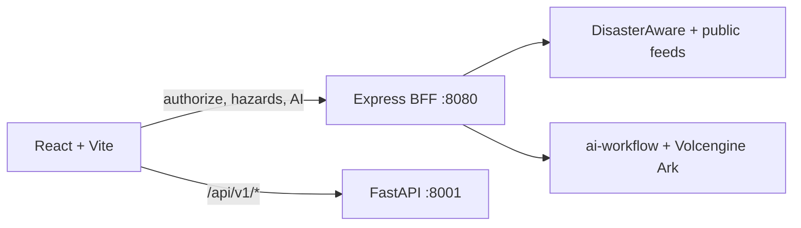

# Prometheus Global Guardian

[中文](#中文) | [English](#english)

## English

Prometheus Global Guardian is a local-development platform for global hazard monitoring, map situational awareness, data analysis, and AI-assisted incident assessment. This repository is not deployed.

### Architecture



The BFF handles authorization, hazard aggregation, and AI routing. The browser calls FastAPI analytics directly. Browser assets never contain DisasterAware credentials, upstream tokens, or model keys.

`MapStateProvider` owns hazards, filters, map style, source metadata, and refresh. `UIStateProvider` owns the active page and modal. `App` only initializes authorization, combines providers, and selects rendering.

### Capabilities

- DisasterAware aggregation with USGS, NASA EONET, and GDACS fallback feeds.
- Mapbox events, filters, popups, heatmap, clustering, and optional 3D layers.
- FastAPI statistics, prediction, risk, data quality, ETL, unified-model, and pivot workflows.
- Streaming AI analysis through the BFF.
- JSON download of the current filtered hazard report.

### Requirements and local start

| Runtime | Version            |
| ------- | ------------------ |
| Node.js | `>=20.19 <21`      |
| pnpm    | `10.15.1`          |
| Python  | `3.13` recommended |

```bash
pnpm install
pnpm dev
./scripts/start-python-service.sh
```

Default ports: Vite `5173`, Express `8080`, FastAPI `8001`.

### Configuration and security

Public browser variables include `VITE_MAPBOX_TOKEN`, `VITE_PYTHON_API_URL`, and `VITE_LOG_LEVEL`. Server-only variables include `DISASTERAWARE_USERNAME`, `DISASTERAWARE_PASSWORD`, `AI_PROVIDER`, AI provider credentials, `ANALYTICS_ADMIN_TOKEN`, `ANALYTICS_CORS_ORIGINS`, and `LOG_LEVEL`. Do not use a `VITE_` prefix for credentials.

FastAPI keeps `/health` public. After configuring `ANALYTICS_ADMIN_TOKEN`, `/metrics` and `/cache/clear` require `X-Analytics-Admin-Token`.

### Testing and CI

```bash
pnpm run lint
pnpm run format:check
pnpm run typecheck:client
pnpm run typecheck:server
pnpm run typecheck:contracts
pnpm run test:services
pnpm run test:component
pnpm run test:python
pnpm run build
```

GitHub Actions runs frontend/BFF baseline and Python analytics tests separately. In restricted sandboxes, BFF tests in `pnpm test` can fail with `listen EPERM` while binding `0.0.0.0`; this is an environment limitation.

### Docker

```bash
docker compose up --build
```

Compose is a local full-stack startup path. It publishes web on `8080` and analytics on `127.0.0.1:8001`.

### Structure

```text
src/                         React features and services
server/                      Express BFF boundaries
python-analytics-service/    FastAPI application and analytics modules
tests/                       BFF, service, component, and E2E tests
contracts/                   Cross-language hazard fixtures
docs/                        Designs, plans, baseline, and backlog
```

## 中文

Prometheus Global Guardian 是面向本地开发的全球灾害监测、地图态势展示、数据分析与 AI 辅助研判平台。本仓库当前不包含部署实施。

### 架构

浏览器通过 Express BFF 访问授权、灾害聚合和 AI；浏览器直接请求 FastAPI 的 `/api/v1/*`。浏览器产物不包含 DisasterAware 凭据、上游令牌或模型密钥。

`MapStateProvider` 管理灾害数据、筛选、地图样式、来源元信息和刷新；`UIStateProvider` 管理页面与弹窗状态；`App` 只负责授权初始化、Provider 组合和渲染选择。

### 能力

- 聚合 DisasterAware，并以 USGS、NASA EONET、GDACS 作为降级来源。
- Mapbox 事件、筛选、Popup、热力图、聚类和可选 3D 图层。
- FastAPI 统计、预测、风险、质量、ETL、统一模型和四维透视分析。
- 通过 BFF 提供 AI 流式研判。
- 将当前筛选后的灾害数据下载为 JSON 报告。

### 运行与配置

运行要求：Node.js `>=20.19 <21`、pnpm `10.15.1`、推荐 Python `3.13`。

```bash
pnpm install
pnpm dev
./scripts/start-python-service.sh
```

默认端口为 Vite `5173`、Express `8080`、FastAPI `8001`。公开前端变量使用 `VITE_MAPBOX_TOKEN`、`VITE_PYTHON_API_URL`、`VITE_LOG_LEVEL`；DisasterAware、AI provider、管理员令牌、CORS 和服务日志均为服务端变量，不能使用 `VITE_` 前缀。

`/health` 公开；配置 `ANALYTICS_ADMIN_TOKEN` 后，`/metrics` 和 `/cache/clear` 必须携带 `X-Analytics-Admin-Token`。

### 质量验证与 Docker

```bash
pnpm run lint
pnpm run format:check
pnpm run typecheck:client
pnpm run typecheck:server
pnpm run typecheck:contracts
pnpm run test:services
pnpm run test:component
pnpm run test:python
pnpm run build
docker compose up --build
```

GitHub Actions 分别执行前端/BFF 基线和 Python 分析测试。受限沙箱中，`pnpm test` 的 BFF 用例可能因绑定 `0.0.0.0` 报 `listen EPERM`，这是环境限制。Docker Compose 仅用于本地完整栈启动，Web 使用 `8080`，分析服务只发布到 `127.0.0.1:8001`。

### 目录

```text
src/                         React 前端与服务层
server/                      Express BFF 边界
python-analytics-service/    FastAPI 与分析模块
tests/                       BFF、Service、组件和 E2E 测试
contracts/                   跨语言灾害样本
docs/                        设计、计划、基线和优化清单
```
