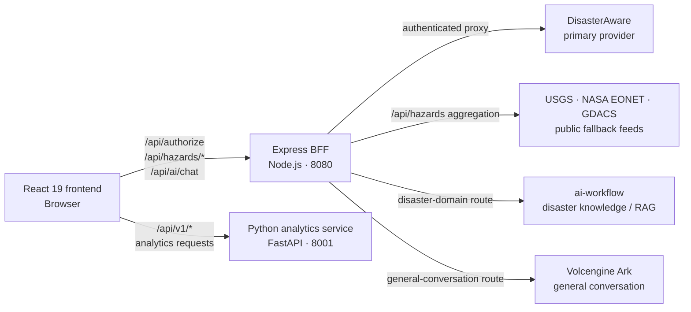
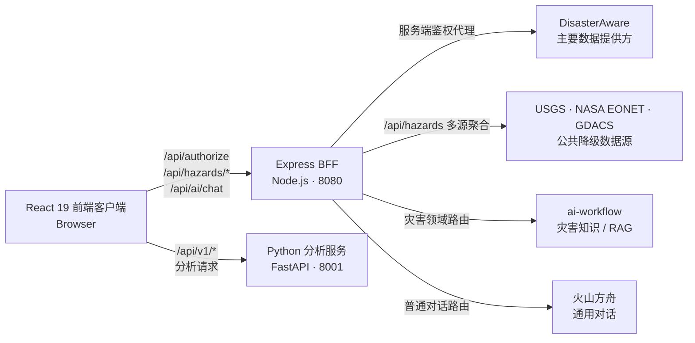

# Prometheus Global Guardian

Languages: [English](#english) | [中文](#中文)

---

## English

Prometheus Global Guardian is an operational platform for global hazard monitoring, geospatial visualization, analytics, and AI-assisted incident assessment.

The system consolidates live hazard feeds, normalizes event data, renders global situational awareness on an interactive map, and provides analytical workflows for risk review, reporting, and decision support.

### Table of Contents

- [Platform Overview](#platform-overview)
- [Core Capabilities](#core-capabilities)
- [System Architecture](#system-architecture)
- [Service Topology](#service-topology)
- [Technology Stack](#technology-stack)
- [Runtime Requirements](#runtime-requirements)
- [Configuration](#configuration)
- [Local Development](#local-development)
- [Testing](#testing)
- [Docker Compose](#docker-compose)
- [Python Analytics Service](#python-analytics-service)
- [AI Assistant Provider](#ai-assistant-provider)
- [Production Build](#production-build)
- [API Surface](#api-surface)
- [Data Sources](#data-sources)
- [Operational Notes](#operational-notes)
- [Security Notes](#security-notes)
- [Project Structure](#project-structure)

### Platform Overview

The platform is organized around four operational domains:

- **Hazard ingestion**: integrates DisasterAware, USGS, NASA EONET, and GDACS feeds.
- **Geospatial operations**: presents active events through Mapbox GL, markers, heatmap mode, clustering, and 3D building layers.
- **Analytics and reporting**: provides statistical summaries, charting, risk assessment, data quality checks, and exportable reports.
- **AI-assisted analysis**: injects live hazard context into an LLM assistant for structured situation summaries and response recommendations.

The platform consists of a React frontend, a lightweight Express API layer, a Python FastAPI analytics service, and external data/model providers.

### Core Capabilities

#### Global Hazard Monitoring

- Visualizes active disaster events across multiple authoritative sources.
- Supports hazard filtering by earthquake, volcano, flood, wildfire, storm, drought, tsunami, and landslide.
- Uses a unified `Hazard` data model across mapping, analytics, AI context, and reporting.
- Cleans hazard data through a Web Worker to reduce UI thread pressure.

#### Geospatial Visualization

- Interactive global map powered by Mapbox GL.
- Supports event markers, contextual popups, and heatmap mode.
- Uses LOD clustering for mid and low zoom levels.
- Provides optional 3D Tiles overlays through deck.gl and loaders.gl.
- Supports configurable Mapbox base map styles.

#### Analytics Workspace

- Presents statistical summaries of active hazard records.
- Renders type, severity, timeline, and source distribution charts with Recharts.
- Uses the Python service for statistics, predictions, risk assessment, ETL, and data quality checks.
- Includes service health, loading, error, retry, and cached-analysis states.
- Presents prediction availability, sample requirements, confidence, risk levels, trends, and quality scores through one display adapter.
- Supports `zh-CN` and `en-US` Analytics result copy resources without changing the Python API shape.
- Builds the disaster-intensity trend from real numeric magnitude fields only; records without intensity are excluded and the valid-record count is shown.
- Samples dense X-axis labels to at most eight evenly spaced labels while keeping the first and last record indexes visible.

#### AI-Assisted Incident Analysis

- Provides a streaming LLM chat interface.
- Injects current hazard context into the system prompt.
- Offers quick prompts for global situation review, flood risk, seismic activity, wildfire threat, forecasting, and emergency response.
- Falls back to local demo responses when no model key is configured.
- Uses the BFF router to send disaster-domain questions to ai-workflow and general conversation to Volcengine Ark.
- Supports Ark's OpenAI-compatible Chat Completions and Responses protocols through the BFF.

#### Reporting and Notifications

- Generates HTML reports from filtered hazard data.
- Uses an in-memory singleton notification manager with a subscription API.
- Integrates browser notifications when permission is granted.
- Provides modal workflows for settings, reporting, analytics, and AI assistance.

### System Architecture



In development, Vite serves the browser client on port `5173`; in production, Express serves the built client on port `8080`. Analytics requests go directly from the browser to FastAPI on port `8001`, while DisasterAware authorization/proxying, public hazard aggregation, and AI provider routing go through the Express BFF. Browser assets never receive DisasterAware credentials, provider API keys, or upstream access tokens.

With `AI_PROVIDER=router`, disaster knowledge, emergency plans, and live hazard analysis use ai-workflow, while general conversation uses Volcengine Ark. Forced provider modes and local Demo fallback are also supported.

The Python analytics service runs as an independent FastAPI process on port `8001` by default.

### Service Topology

| Service                  |     Runtime | Default Port | Responsibility                                   |
| ------------------------ | ----------: | -----------: | ------------------------------------------------ |
| React / Vite client      |     Node.js |         5173 | Frontend development server                      |
| Express server           |     Node.js |         8080 | Static hosting, API proxying, hazard aggregation |
| Python analytics service | Python 3.13 |         8001 | Statistics, prediction, ETL, risk, quality APIs  |
| External LLM provider    |        SaaS |        HTTPS | Chat completion and streaming response           |

### Technology Stack

#### Frontend

| Technology           | Purpose                                    |
| -------------------- | ------------------------------------------ |
| React 19             | Component model and UI rendering           |
| TypeScript 5.9       | Static typing and application contracts    |
| Vite 7               | Development server and production build    |
| Mapbox GL            | Interactive map rendering                  |
| deck.gl / loaders.gl | Optional 3D Tiles integration              |
| Recharts             | Analytics visualizations                   |
| DOMPurify            | Sanitization for rendered assistant output |

#### Backend and Analytics

| Technology          | Purpose                                       |
| ------------------- | --------------------------------------------- |
| Express 5           | API proxy layer and production app server     |
| node-fetch          | Server-side requests to external providers    |
| raw-body            | Request body forwarding for proxied API calls |
| FastAPI             | Python analytics API service                  |
| Pandas / NumPy      | Data processing and numerical computation     |
| SciPy / Statsmodels | Statistical analysis                          |
| Scikit-learn        | Prediction and modeling workflows             |

### Runtime Requirements

| Runtime | Version                           |
| ------- | --------------------------------- |
| Node.js | 20.19.x or later in the 20.x line |
| pnpm    | 10.15.1                           |
| Python  | 3.13 recommended for analytics    |

The repository includes `.nvmrc`. Project commands automatically use the required Node.js version through nvm. To switch the current terminal session manually, use:

```bash
nvm use
```

If the required version is not installed, project commands install it automatically through nvm before starting. This requires nvm and network access on the first run.

Docker images already include Node.js 20.19.0 and do not require nvm.

### Configuration

Create a local environment file:

```bash
cp .env.example .env
```

#### Required Frontend Configuration

```dotenv
VITE_MAPBOX_TOKEN=pk.your_mapbox_token_here
```

#### Optional DisasterAware Credentials (server-side)

```dotenv
DISASTERAWARE_USERNAME=your_username_here
DISASTERAWARE_PASSWORD=your_password_here
```

The Express BFF reads these credentials at runtime; browser assets never receive them. When unavailable, the application can still use public feed fallbacks where supported.

#### Optional Python Analytics Endpoint

```dotenv
VITE_PYTHON_API_URL=http://localhost:8001
```

#### Optional 3D Tiles Configuration

```dotenv
VITE_3D_TILES_URL=
VITE_CESIUM_ION_TOKEN=
```

3D Tiles are optional. When `VITE_3D_TILES_URL` is not set, the map falls back to Mapbox fill-extrusion buildings when supported by the style.

#### Optional AI Provider Configuration (server-side)

```dotenv
AI_PROVIDER=router

VOLCENGINE_WORKFLOW_API_URL=http://localhost:3100/api/v1/apps/run
VOLCENGINE_WORKFLOW_API_KEY=

VOLCENGINE_ARK_API_KEY=your_volcengine_ark_api_key_here
VOLCENGINE_ARK_MODEL=ark-code-latest
VOLCENGINE_ARK_API_URL=https://ark.cn-beijing.volces.com/api/plan/v3
VOLCENGINE_ARK_TIMEOUT_MS=30000
```

Set `AI_PROVIDER=router` to let the BFF route disaster knowledge, Guardian rules, historical cases, emergency plans, and live hazard analysis to the published ai-workflow app, while general conversation and explanations use Volcengine Ark. Set `AI_PROVIDER=workflow` or `AI_PROVIDER=ark` to force one provider for troubleshooting or compatibility. The workflow path sends the workflow-specific start-node inputs: `user_input` (string), `hazard_context` (object), `location` (string), and `language` (string). It sends `stream: true` in the JSON request body, then converts the workflow's SSE `complete` event or regular JSON response into the frontend chat stream format. The workflow API key remains server-side.
If the BFF runs in Docker while the workflow app runs on your host machine, use `http://host.docker.internal:3100/api/v1/apps/run` instead of `http://localhost:3100/api/v1/apps/run`.

`VOLCENGINE_ARK_API_URL` may be the Volcengine Ark OpenAI-compatible Responses API base URL, such as `https://ark.cn-beijing.volces.com/api/plan/v3`; the BFF appends `/responses` internally when needed. `VOLCENGINE_ARK_TIMEOUT_MS` controls how long the BFF waits for the provider to start responding. These variables are read by the Express BFF at runtime and are not exposed to browser assets.

### Local Development

Install dependencies with the repository's pinned package manager:

```bash
pnpm install
```

`pnpm-lock.yaml` is the canonical lockfile for local and Docker installs. The existing `package-lock.json` is retained for legacy compatibility and is not used by the Dockerfile.

Start the Express BFF in one terminal. It supplies `/api/authorize`, `/api/hazards/*`, and `/api/ai/chat` for the Vite proxy:

```bash
pnpm run build:server
node dist-server/server.js
```

Start the frontend development server in a second terminal:

```bash
pnpm run dev
```

Open:

```text
http://localhost:5173
```

### Testing

Run the unit-test suite:

```bash
pnpm test
```

`pnpm test` is an alias for `pnpm run test:unit`. It runs the server-side BFF tests and the frontend Service-layer Vitest tests. Current test sources live in `tests/`:

- `tests/ai-provider.test.ts`: provider configuration and Ark / Workflow request construction.
- `tests/ai-router.test.ts`: smart routing signals, live hazard context, forced provider modes, and fallback order.
- `tests/ai-stream.test.ts`: Ark and Workflow SSE response conversion.
- `tests/server-auth.test.ts`: BFF authorization, token injection, refresh, and local hazard aggregation.
- `tests/service-http.test.ts`, `tests/service-adapters.test.ts`, `tests/service-analytics.test.ts`, and `tests/service-ai.test.ts`: frontend Service-layer unit tests.
- `tests/service-analytics-presentation.test.ts`: Analytics status, score, trend, recommendation, and quality-text presentation tests.
- `tests/service-hazard-metrics.test.ts`: normalized magnitude priority, compatible fields, zero values, and missing-intensity behavior.
- `tests/component/analytics-transforms.test.tsx`: Analytics hazard grouping, intensity series, and cache-key transformation tests.
- `tests/component/use-analytics-data.test.tsx`: Analytics service orchestration, cache, empty-data, and manual rerun Hook tests.
- `tests/component/analytics-page.test.tsx`: Analytics compatibility entry and five-tab composition tests.

Run the two unit-test groups independently with `pnpm run test:bff` and `pnpm run test:services`. These tests do not open a browser or exercise React components, page interactions, or visual layout.

Run React component tests with Vitest, React Testing Library, and jsdom:

```bash
pnpm run test:component
```

Run the browser smoke test with Playwright. The test starts the local production server and mocks DisasterAware, hazard feeds, Mapbox, and the AI provider:

```bash
pnpm run test:e2e
```

Run the complete local quality baseline:

```bash
pnpm run test:baseline
```

The baseline runs ESLint, Prettier check, client and server type checks, BFF and Service unit tests, React component tests, the Playwright smoke test, and the production build. Python API contract tests are currently run as a separate command. See [`docs/TESTING_BASELINE.md`](docs/TESTING_BASELINE.md) for current counts, boundaries, and known non-blocking warnings.

Run the Python API contract tests separately from the repository root:

```bash
cd python-analytics-service
python -m unittest discover -s tests -p 'test_*.py'
```

These tests do not require a running analytics service. `test_api_contract.py` validates the request model and direct endpoint behavior; `test_api_routes.py` uses FastAPI `TestClient` to validate five 4D HTTP routes, 2xx responses, parameter forwarding, response echoing, empty results, and 422 validation.

Run linting:

```bash
pnpm run lint
pnpm run format:check
pnpm run typecheck:client
pnpm run typecheck:server
```

Command purposes:

- `pnpm run lint`: runs ESLint to check code rules and potential issues.
- `pnpm run format:check`: runs Prettier to verify formatting without changing files.
- `pnpm run typecheck:client`: runs TypeScript checks for the React frontend without emitting files.
- `pnpm run typecheck:server`: runs TypeScript checks for the Express BFF without emitting files.

For local Vite development, keep the Express BFF available on `http://localhost:8080`; Vite proxies all `/api` calls to it. Analytics requests go directly from the browser to `VITE_PYTHON_API_URL`. Docker Compose is the simplest way to run the full stack.

### Docker Compose

Docker Compose is the recommended one-command startup path for running the production web server, Express BFF, and Python analytics service together.

Start all services:

```bash
docker compose up --build
```

Open the application:

```text
http://localhost:8080
```

Check the analytics service:

```text
http://localhost:8001/health
```

Stop the services:

```bash
docker compose down
```

Follow logs:

```bash
docker compose logs -f
```

Docker reads safe build-time frontend variables from `.env`. The Compose build only passes public `VITE_MAPBOX_TOKEN`, `VITE_PYTHON_API_URL`, and optional 3D Tiles variables into the frontend image. `DISASTERAWARE_*` and AI provider variables are passed only to the Express runtime. Do not bake credentials or model provider keys into browser assets.

Keep `VITE_PYTHON_API_URL=http://localhost:8001` for the Docker setup because analytics requests are made by the browser through the host-published port.

The Docker image uses the repository's `pnpm-lock.yaml` for reproducible dependency installation. Frontend build arguments are public; runtime secrets are provided to the Express container only.

Check running containers:

```bash
docker compose ps
```

### Python Analytics Service

The analytics service runs independently from the React application and must be started separately when analytics features are required.

See the dedicated [Python Analytics Service README](python-analytics-service/README.md) for its request model, endpoint catalog, test scripts, and known analysis limitations.

Recommended command from the repository root:

```bash
chmod +x scripts/start-python-service.sh && ./scripts/start-python-service.sh
```

Manual startup:

```bash
cd python-analytics-service
python3.13 -m venv venv
source venv/bin/activate
pip install -r requirements.txt
python main.py
```

Service endpoints:

| URL                            | Purpose                   |
| ------------------------------ | ------------------------- |
| `http://localhost:8001/health` | Health check              |
| `http://localhost:8001/docs`   | Swagger API documentation |
| `http://localhost:8001/redoc`  | ReDoc API documentation   |

### AI Assistant Provider

The AI assistant selects providers through the BFF:

1. Calls the project BFF endpoint `POST /api/ai/chat`.
2. With `AI_PROVIDER=router`, disaster-domain and knowledge-base questions call the published ai-workflow app; general conversation calls Volcengine Ark.
3. With `AI_PROVIDER=workflow` or `AI_PROVIDER=ark`, the BFF forces the corresponding provider.
4. In router mode, a provider failure before response output starts falls back to the other configured provider. Once streaming has started, the BFF keeps the original response intact.
5. For `https://ark.cn-beijing.volces.com/api/plan/v3`, the BFF adapts the request to the Responses API and converts streamed deltas back to the frontend chat stream format.
6. Each request logs the route reason, selected provider, fallback status, attempt count, result status, and latency without logging message content or credentials.
7. The frontend falls back to local demo responses when neither provider is configured.

The browser no longer reads model provider keys directly. Keep model credentials server-side and pass them to the Express runtime through `.env`, Docker Compose, or deployment secrets.
If the provider does not start responding before `VOLCENGINE_ARK_TIMEOUT_MS`, the BFF returns a sanitized timeout error instead of leaving the chat request open indefinitely.

### Production Build

Build the client:

```bash
pnpm run build
```

The build also compiles the Express BFF into `dist-server/`.

Start the production Express server:

```bash
pnpm start
```

Default server URL:

```text
http://localhost:8080
```

Static-only hosting:

```bash
pnpm run start:static
```

### API Surface

#### Express API Layer

| Endpoint                             | Method | Description                                                                                       |
| ------------------------------------ | ------ | ------------------------------------------------------------------------------------------------- |
| `/api/authorize`                     | `POST` | Authenticates with DisasterAware using server-side credentials; returns authorization status only |
| `/api/hazards`                       | `GET`  | Aggregates public hazard feeds from USGS, NASA EONET, and GDACS                                   |
| `/api/hazards?source=USGS,NASA`      | `GET`  | Filters aggregation by source                                                                     |
| `/api/hazards?type=EARTHQUAKE,FLOOD` | `GET`  | Filters aggregation by hazard type                                                                |
| `/api/ai/chat`                       | `POST` | Streams AI assistant responses through the Express BFF                                            |
| `/api/hazards/*`                     | Any    | Proxies authenticated DisasterAware hazard requests through the BFF                               |
| `/api/*`                             | Any    | Proxies other authenticated API calls to DisasterAware                                            |

#### Python Analytics API

| Endpoint                     | Method | Description                                              |
| ---------------------------- | ------ | -------------------------------------------------------- |
| `/`                          | `GET`  | Service information                                      |
| `/health`                    | `GET`  | Service health check                                     |
| `/metrics`                   | `GET`  | Service metrics summary                                  |
| `/cache/clear`               | `POST` | Clear the analytics cache                                |
| `/api/v1/analyze`            | `POST` | Run the unified analysis workflow                        |
| `/api/v1/statistics`         | `POST` | Statistical analysis                                     |
| `/api/v1/predictions`        | `POST` | Predictive analysis                                      |
| `/api/v1/risk-assessment`    | `POST` | Risk scoring and recommendations                         |
| `/api/v1/etl/process`        | `POST` | Data normalization and quality processing                |
| `/api/v1/quality/assess`     | `POST` | Data quality assessment                                  |
| `/api/v1/quality/thresholds` | `GET`  | Quality thresholds                                       |
| `/api/v1/quality/history`    | `GET`  | Quality assessment history                               |
| `/api/v1/pivot/*`            | `POST` | Pivot creation, query, trend, risk, and summary analysis |
| `/api/v1/unified-model/*`    | `POST` | Unified model transformation and merge operations        |

### Data Sources

| Source        | Scope                        | Usage                                                      |
| ------------- | ---------------------------- | ---------------------------------------------------------- |
| DisasterAware | Active hazard and type APIs  | Primary authenticated provider                             |
| USGS          | Earthquake GeoJSON feeds     | Earthquake fallback and aggregation source                 |
| NASA EONET    | Environmental event tracking | Wildfire, volcano, flood, storm, drought, landslide events |
| GDACS         | Global disaster alerts       | Global alert and coordination data                         |

### Operational Notes

- The Python analytics service must be available at `VITE_PYTHON_API_URL` for workflows that call FastAPI endpoints.
- When the Python service is offline, map and public hazard workflows can still run, while analytics panels may show offline or error states.
- `pnpm start` serves the built app through Express and enables the backend `/api/hazards` aggregation endpoint.
- `docker compose up --build` is the recommended way to run the production Web / Express BFF and Python analytics service together.
- `pnpm run dev` uses Vite for frontend development; all `/api` requests are proxied to the local Express BFF.
- Mapbox rendering requires a valid `VITE_MAPBOX_TOKEN`.
- `dist/` is generated output and should be rebuilt for production releases.

### Security Notes

- `.env` is ignored by git and must not be committed.
- Variables prefixed with `VITE_` are exposed to browser assets; do not place production-only secrets there.
- For production AI usage, prefer a server-side proxy for Volcengine Ark or other model providers.
- Review proxy logging in `server.ts` before production deployment; current AI router logs omit message content and credentials, but deployment logging policies should still be checked.
- DisasterAware credentials and model provider keys should be managed through deployment secret storage.

### Project Structure

```text
prometheus-global-guardian/
├── .husky/
│   ├── commit-msg
│   └── pre-commit
├── docs/
│   ├── PROJECT_OPTIMIZATION_BACKLOG.md
│   ├── TESTING_BASELINE.md
│   └── superpowers/plans/
│       ├── 2026-09-02-bff-typescript-migration.md
│       ├── 2026-09-03-api-service-layer-unification.md
│       ├── 2026-09-03-frontend-testing-baseline.md
│       ├── 2026-09-03-project-governance.md
│       ├── 2026-09-03-unify-hazard-analytics-contract.md
│       ├── 2026-09-04-analytics-contract-http-integration.md
│       ├── 2026-09-04-analytics-result-semantics.md
│       ├── 2026-09-04-analytics-presentation-phase2.md
│       ├── 2026-09-04-statistics-chart-axis-layout.md
│       ├── 2026-09-06-map-module-split.md
│       └── 2026-09-08-analytics-page-split.md
├── public/
│   └── assets/                  # Logo and static assets
├── scripts/
│   ├── start-python-service.sh   # Start the local Python analytics service
│   └── with-node-version.sh      # Run commands with the Node.js version from .nvmrc
├── python-analytics-service/
│   ├── analytics/
│   │   ├── etl_processor.py
│   │   ├── pivot_table_analyzer.py
│   │   ├── prediction_models.py
│   │   ├── quality_monitor.py
│   │   ├── risk_assessment.py
│   │   ├── statistical_algorithms.py
│   │   └── unified_model.py
│   ├── tests/
│   │   ├── test_api_contract.py
│   │   ├── test_api_routes.py
│   │   └── test_result_semantics.py
│   ├── main.py
│   ├── requirements.txt
│   ├── README.md
│   ├── start.sh
│   ├── demo_test.py
│   ├── test_pivot_table.py
│   └── test_service.py
├── src/
│   ├── services/                # Frontend business and network services
│   │   ├── ai/aiAssistantService.ts
│   │   ├── analytics/
│   │   │   ├── analyticsPresentation.ts
│   │   │   ├── analyticsService.ts
│   │   │   └── analyticsTypes.ts
│   │   ├── auth/authService.ts
│   │   ├── hazards/
│   │   │   ├── hazardAdapters.ts
│   │   │   └── hazardService.ts
│   │   └── http/
│   │       ├── httpClient.ts
│   │       └── serviceError.ts
│   ├── components/              # React UI components
│   ├── config/                  # Public frontend configuration
│   ├── types/                   # Shared frontend domain types
│   ├── utils/                   # UI helpers and utilities
│   │   ├── chartLabels.ts
│   │   ├── hazardMetrics.ts
│   │   ├── aiAssistant.ts
│   │   ├── dataExport.ts
│   │   └── notifications.ts
│   ├── workers/                 # Web Workers
│   ├── App.tsx
│   ├── index.css
│   └── index.tsx
├── server/
│   ├── ai/
│   │   ├── ai-chat-route.ts
│   │   ├── ai-provider.ts
│   │   └── ai-stream.ts
│   ├── hazards/
│   │   └── hazard-source.ts     # USGS, NASA EONET, and GDACS aggregation
│   ├── env.ts
│   └── express.d.ts
├── tests/
│   ├── component/
│   │   ├── setup.ts
│   │   ├── data-visualization.test.tsx
│   │   ├── data-quality-monitor.test.tsx
│   │   └── status-panel.test.tsx
│   ├── e2e/
│   │   └── app-smoke.spec.ts
│   ├── ai-provider.test.ts
│   ├── ai-router.test.ts
│   ├── ai-stream.test.ts
│   ├── server-auth.test.ts
│   ├── service-adapters.test.ts
│   ├── service-analytics.test.ts
│   ├── service-analytics-presentation.test.ts
│   ├── service-hazard-metrics.test.ts
│   ├── service-ai.test.ts
│   └── service-http.test.ts
├── AGENTS.md                   # Project-level development constraints
├── .gitignore
├── .env.example
├── .prettierignore
├── .prettierrc.json
├── cspell.json
├── commitlint.config.cjs
├── server.ts
├── eslint.config.js
├── package-lock.json
├── package.json
├── pnpm-lock.yaml
├── tsconfig.app.json
├── tsconfig.json
├── tsconfig.node.json
├── tsconfig.server.json
├── tsconfig.server.test.json
├── docker-compose.yml
├── .dockerignore
├── Dockerfile
├── vite.config.ts
├── vitest.config.ts
├── vitest.component.config.ts
└── playwright.config.ts
```

### License

MIT

---

## 中文

Prometheus Global Guardian 是一套面向灾害监测、地理态势可视化、数据分析和 AI 辅助研判的全球灾害运营平台。

系统整合实时灾害数据源，统一事件数据结构，在交互式地图上呈现全球态势，并为风险复盘、报告导出和应急决策提供分析工作流。

### 目录

- [平台概览](#平台概览)
- [核心能力](#核心能力)
- [系统架构](#系统架构)
- [服务拓扑](#服务拓扑)
- [技术栈](#技术栈)
- [运行环境](#运行环境)
- [配置](#配置)
- [本地开发](#本地开发)
- [测试](#测试)
- [Docker Compose](#docker-compose-1)
- [Python 分析服务](#python-分析服务)
- [AI 助手模型服务](#ai-助手模型服务)
- [生产构建](#生产构建)
- [API 接口](#api-接口)
- [数据源](#数据源)
- [运维说明](#运维说明)
- [安全说明](#安全说明)
- [项目结构](#项目结构)

### 平台概览

平台围绕四个核心运营域构建：

- **灾害数据接入**：接入 DisasterAware、USGS、NASA EONET、GDACS 等灾害数据源。
- **地理态势展示**：通过 Mapbox GL 展示灾害标记、热力图、聚合图层和 3D 建筑图层。
- **分析与报告**：提供统计汇总、图表分析、风险评估、数据质量检查和报告导出。
- **AI 辅助研判**：将实时灾害上下文注入大模型助手，生成结构化态势分析和响应建议。

平台由 React 前端、轻量 Express API 层、Python FastAPI 分析服务，以及外部数据和模型服务共同组成。

### 核心能力

#### 全球灾害监测

- 多源活跃灾害事件可视化，覆盖权威公共数据源和 DisasterAware 接口。
- 支持按灾害类型筛选，包括地震、火山、洪水、野火、风暴、干旱、海啸和滑坡。
- 使用统一的 `Hazard` 数据结构支撑地图渲染、分析、AI 上下文和报告导出。
- 使用 Web Worker 清洗灾害数据，降低主线程压力。

#### 地理态势可视化

- 基于 Mapbox GL 的交互式全球地图。
- 支持灾害标记、弹窗详情和热力图模式。
- 使用 LOD 聚合策略优化中低缩放层级的点位展示。
- 可选接入 deck.gl 和 loaders.gl 的 3D Tiles 图层。
- 支持切换 Mapbox 底图样式。

#### 分析工作台

- 展示活跃灾害记录的统计概览。
- 使用 Recharts 渲染类型分布、严重程度分布、时间趋势和数据源分布。
- 通过 Python 服务提供统计分析、预测分析、风险评估、ETL 和数据质量检查。
- 分析页面包含服务健康状态、加载状态、错误处理、重试和分析缓存控制。
- 预测、风险和质量结果统一经过展示适配：明确样本状态、置信度、风险等级、趋势、分数范围和中文建议。
- 展示适配器支持 `zh-CN` 和 `en-US` 文案资源，不改变 Python API 契约。
- 灾害强度趋势只使用真实数值强度字段；缺少强度的记录会排除，并显示有效数据量。
- 大数据量时 X 轴最多显示 8 个均匀抽样的标签，同时保留首尾记录编号。

#### AI 辅助研判

- 支持流式 LLM 对话体验。
- 自动将当前灾害上下文注入 System Prompt。
- 提供全球态势、洪水、地震、野火、趋势预测、应急响应等快捷分析入口。
- 未配置模型 Key 时自动进入本地 Demo 降级模式。
- 由 BFF Router 将灾害领域问题发送到 ai-workflow，将普通对话发送到火山方舟。
- 通过 BFF 兼容火山方舟的 OpenAI-compatible Chat Completions 和 Responses 协议。

#### 报告与通知

- 支持基于筛选数据生成 HTML 灾害报告。
- 通知中心使用内存单例管理器和订阅 API。
- 浏览器通知权限允许时可触发系统通知。
- 提供设置、报告、分析和 AI 助手等模态工作流。

### 系统架构



开发环境由 Vite 在 `5173` 端口提供浏览器前端，生产环境由 Express 在 `8080` 端口托管构建产物。Analytics 请求由浏览器直接发送到 `8001` 端口的 FastAPI；DisasterAware 鉴权/代理、公共灾害数据聚合和 AI provider 路由经过 Express BFF。浏览器构建产物不会接收 DisasterAware 凭据、模型服务 Key 或上游 access token。

当 `AI_PROVIDER=router` 时，灾害知识、应急预案和实时灾害分析调用 ai-workflow，普通对话调用火山方舟。项目同时支持强制指定 provider，以及未配置模型服务时的本地 Demo 降级。

Python 分析服务作为独立 FastAPI 进程运行，默认端口为 `8001`。

### 服务拓扑

| 服务                     |      运行时 | 默认端口 | 职责                                |
| ------------------------ | ----------: | -------: | ----------------------------------- |
| React / Vite client      |     Node.js |     5173 | 本地开发前端服务                    |
| Express server           |     Node.js |     8080 | 生产静态托管、API 代理、灾害聚合    |
| Python analytics service | Python 3.13 |     8001 | 统计、预测、ETL、风险和数据质量接口 |
| External LLM provider    |        SaaS |    HTTPS | AI 对话补全和流式响应               |

### 技术栈

#### 前端

| 技术                 | 用途               |
| -------------------- | ------------------ |
| React 19             | UI 组件和渲染      |
| TypeScript 5.9       | 静态类型和应用契约 |
| Vite 7               | 开发服务和生产构建 |
| Mapbox GL            | 交互式地图渲染     |
| deck.gl / loaders.gl | 可选 3D Tiles 集成 |
| Recharts             | 分析图表           |
| DOMPurify            | AI 输出内容净化    |

#### 后端与分析

| 技术                | 用途                 |
| ------------------- | -------------------- |
| Express 5           | API 代理层和生产服务 |
| node-fetch          | 服务端外部请求       |
| raw-body            | 代理请求体转发       |
| FastAPI             | Python 分析 API 服务 |
| Pandas / NumPy      | 数据处理和数值计算   |
| SciPy / Statsmodels | 统计分析             |
| Scikit-learn        | 预测和建模流程       |

### 运行环境

| 运行时  | 版本                     |
| ------- | ------------------------ |
| Node.js | 20.19.x 或 20.x 最新版本 |
| pnpm    | 10.15.1                  |
| Python  | 推荐 3.13，用于分析服务  |

仓库包含 `.nvmrc`。项目启动、构建、测试和代码检查命令会通过 nvm 自动使用要求的 Node.js 版本。需要手动切换当前终端会话时，可执行：

```bash
nvm use
```

如果要求的版本尚未安装，项目命令会在首次运行前通过 nvm 自动安装；首次安装需要 nvm 和网络访问权限。

Docker 镜像已内置 Node.js 20.19.0，不需要安装 nvm。

### 配置

创建本地环境变量文件：

```bash
cp .env.example .env
```

#### 必需前端配置

```dotenv
VITE_MAPBOX_TOKEN=pk.your_mapbox_token_here
```

#### 可选 DisasterAware 凭据（仅服务端）

```dotenv
DISASTERAWARE_USERNAME=your_username_here
DISASTERAWARE_PASSWORD=your_password_here
```

Express BFF 会在运行时读取这些凭据，浏览器构建产物不会包含它们。未配置 DisasterAware 凭据时，应用仍可在支持的场景下使用公共数据源降级。

#### 可选 Python 分析服务地址

```dotenv
VITE_PYTHON_API_URL=http://localhost:8001
```

#### 可选 3D Tiles 配置

```dotenv
VITE_3D_TILES_URL=
VITE_CESIUM_ION_TOKEN=
```

3D Tiles 为可选能力。未配置 `VITE_3D_TILES_URL` 时，地图会在样式支持的情况下回退到 Mapbox fill-extrusion 建筑图层。

#### 可选 AI 模型服务配置（仅服务端）

```dotenv
AI_PROVIDER=router

VOLCENGINE_WORKFLOW_API_URL=http://localhost:3100/api/v1/apps/run
VOLCENGINE_WORKFLOW_API_KEY=

VOLCENGINE_ARK_API_KEY=your_volcengine_ark_api_key_here
VOLCENGINE_ARK_MODEL=ark-code-latest
VOLCENGINE_ARK_API_URL=https://ark.cn-beijing.volces.com/api/plan/v3
VOLCENGINE_ARK_TIMEOUT_MS=30000
```

设置 `AI_PROVIDER=router` 时，BFF 会把灾害专业知识、Guardian 规则、历史案例、应急预案和实时灾害分析问题发送给已发布的 ai-workflow，把普通闲聊和通用解释发送给火山方舟。设置 `AI_PROVIDER=workflow` 或 `AI_PROVIDER=ark` 可以强制使用单一 provider。工作流路径会按照开始节点契约发送 `user_input`（字符串）、`hazard_context`（对象）、`location`（字符串）和 `language`（字符串），并将 `stream: true` 放在 JSON 请求体中；工作流 API Key 始终只保留在服务端。
如果 BFF 运行在 Docker 容器中，而工作流应用运行在宿主机，请将工作流地址改为 `http://host.docker.internal:3100/api/v1/apps/run`，不要使用 `http://localhost:3100/api/v1/apps/run`。

`VOLCENGINE_ARK_API_URL` 可以使用火山方舟 OpenAI-compatible Responses API 的 Base URL，例如 `https://ark.cn-beijing.volces.com/api/plan/v3`；BFF 会在需要时内部拼接 `/responses`。`VOLCENGINE_ARK_TIMEOUT_MS` 控制 BFF 等待模型服务开始响应的时间。这些变量由 Express BFF 在运行时读取，不会暴露到浏览器构建产物中。

### 本地开发

使用仓库固定的包管理器安装依赖：

```bash
pnpm install
```

`pnpm-lock.yaml` 是本地和 Docker 安装依赖时使用的规范锁文件。现有 `package-lock.json` 仅为兼容旧环境保留，Dockerfile 不会使用它。

先在一个终端启动 Express BFF。它为 Vite 提供 `/api/authorize`、`/api/hazards/*` 和 `/api/ai/chat`：

```bash
pnpm run build:server
node dist-server/server.js
```

再在第二个终端启动前端开发服务：

```bash
pnpm run dev
```

访问：

```text
http://localhost:5173
```

### 测试

运行单元测试：

```bash
pnpm test
```

`pnpm test` 是 `pnpm run test:unit` 的别名，会先运行服务端 BFF 测试，再运行前端 Service 层的 Vitest 测试。当前测试代码都位于 `tests/`：

- `tests/ai-provider.test.ts`：provider 配置以及 Ark / Workflow 请求构造。
- `tests/ai-router.test.ts`：智能路由信号、实时灾害上下文、强制 provider 模式和 fallback 顺序。
- `tests/ai-stream.test.ts`：Ark 和 Workflow 的 SSE 响应转换。
- `tests/server-auth.test.ts`：BFF 鉴权、token 注入、过期刷新和本地灾害聚合测试。
- `tests/service-http.test.ts`：统一 HTTP 客户端的成功、超时、重试和错误测试。
- `tests/service-adapters.test.ts`：USGS、NASA、GDACS 数据适配测试。
- `tests/service-analytics.test.ts`：Analytics 数据格式化和时间戳回退测试。
- `tests/service-ai.test.ts`：AI 请求、SSE 增量、错误处理和 Demo 降级测试。
- `tests/service-analytics-presentation.test.ts`：Analytics 状态、分数、趋势、建议和质量文案展示测试。
- `tests/service-hazard-metrics.test.ts`：标准震级优先级、兼容字段、零值和缺失强度处理测试。

拆分运行时可以使用 `pnpm run test:bff` 和 `pnpm run test:services`。Service 测试属于前端业务层单元测试，不会打开浏览器，也不会测试 React 组件、页面交互或视觉布局。

运行 React 组件测试：

```bash
pnpm run test:component
```

该命令使用 Vitest、React Testing Library 和 jsdom，验证组件的加载状态、用户交互和对外回调。当前组件测试位于 `tests/component/`。

运行 Playwright 浏览器冒烟测试：

```bash
pnpm run test:e2e
```

该命令会启动本地生产服务，使用 mock 隔离 DisasterAware、灾害数据源、Mapbox 和 AI provider，并验证首页加载、灾害类型筛选、AI 助手打开和消息展示。当前 E2E 测试位于 `tests/e2e/`；失败时会保留截图，重试时保留 trace。

运行完整测试基线：

```bash
pnpm run test:baseline
```

该命令依次执行 ESLint、Prettier、前后端类型检查、BFF/Service 单元测试、React 组件测试、Playwright 冒烟测试和生产构建。Python API 契约测试目前单独执行；当前测试数量、覆盖边界和已知非阻塞 warning 见 [`docs/TESTING_BASELINE.md`](docs/TESTING_BASELINE.md)。

单独运行 Python API 契约测试：

```bash
cd python-analytics-service
python -m unittest discover -s tests -p 'test_*.py'
```

这组测试不需要启动 Python 服务：`test_api_contract.py` 验证请求模型和直接端点行为，`test_api_routes.py` 使用 FastAPI `TestClient` 验证五个 4D HTTP 路由、参数回显、空结果和 2xx/422 状态码。

运行代码检查：

```bash
pnpm run lint
pnpm run format:check
pnpm run typecheck:client
pnpm run typecheck:server
```

各命令用途如下：

- `pnpm run lint`：运行 ESLint，检查代码规范和潜在问题。
- `pnpm run format:check`：运行 Prettier 检查代码格式，不会修改文件。
- `pnpm run typecheck:client`：运行 TypeScript 前端类型检查，不生成编译文件。
- `pnpm run typecheck:server`：运行 TypeScript Express BFF 类型检查，不生成编译文件。

本地 Vite 开发时必须让 Express BFF 运行在 `http://localhost:8080`，Vite 会将所有 `/api` 请求代理到 BFF。Analytics 请求则由浏览器直接发送到 `VITE_PYTHON_API_URL`。最简单的全栈启动方式是 Docker Compose。

### Docker Compose

Docker Compose 是推荐的一键启动方式，可以同时运行生产 Web 服务、Express BFF 和 Python 分析服务。

启动所有服务：

```bash
docker compose up --build
```

访问应用：

```text
http://localhost:8080
```

检查分析服务：

```text
http://localhost:8001/health
```

停止服务：

```bash
docker compose down
```

查看日志：

```bash
docker compose logs -f
```

Docker 会从 `.env` 读取安全的前端构建期变量。Compose 构建只会把公开的 `VITE_MAPBOX_TOKEN`、`VITE_PYTHON_API_URL` 和可选 3D Tiles 变量注入前端镜像；`DISASTERAWARE_*` 和 AI provider 变量只注入 Express 运行时。不要把凭据或模型服务 Key 打进浏览器产物。

Docker 场景建议保持 `VITE_PYTHON_API_URL=http://localhost:8001`，因为分析请求由浏览器通过宿主机暴露端口发起。

Docker 镜像使用仓库的 `pnpm-lock.yaml` 安装固定依赖。前端构建参数均为公开配置；运行时密钥只注入 Express 容器。

查看容器状态：

```bash
docker compose ps
```

### Python 分析服务

分析服务独立于 React 应用运行，使用分析功能时需要单独启动。

Python 服务的请求模型、完整接口、测试脚本和已知分析限制见 [Python 分析服务 README](python-analytics-service/README.md)。

推荐从仓库根目录执行：

```bash
chmod +x scripts/start-python-service.sh && ./scripts/start-python-service.sh
```

手动启动：

```bash
cd python-analytics-service
python3.13 -m venv venv
source venv/bin/activate
pip install -r requirements.txt
python main.py
```

服务端点：

| URL                            | 用途             |
| ------------------------------ | ---------------- |
| `http://localhost:8001/health` | 健康检查         |
| `http://localhost:8001/docs`   | Swagger API 文档 |
| `http://localhost:8001/redoc`  | ReDoc API 文档   |

### AI 助手模型服务

AI 助手由 BFF 统一选择模型服务：

1. 前端调用项目 BFF 接口 `POST /api/ai/chat`。
2. `AI_PROVIDER=router` 时，灾害专业和知识库问题调用已发布的 ai-workflow，普通对话调用火山方舟。
3. `AI_PROVIDER=workflow` 或 `AI_PROVIDER=ark` 时，BFF 强制使用对应 provider。
4. router 模式下，provider 在开始输出前失败时会尝试另一个已配置 provider；流式输出开始后保持原响应，不拼接两家结果。
5. 当 `VOLCENGINE_ARK_API_URL` 为 `https://ark.cn-beijing.volces.com/api/plan/v3` 时，BFF 自动适配 Responses API，并把流式增量转换回前端聊天流格式。
6. 每次请求记录路由原因、provider、是否降级、尝试次数、状态和耗时，不记录消息内容或凭据。
7. 两个 provider 都未配置时，前端进入本地 Demo 响应。

浏览器不再直接读取模型服务 Key。模型凭据应保留在服务端，通过 `.env`、Docker Compose 或部署平台密钥注入 Express 运行时。
BFF 会在 `VOLCENGINE_ARK_TIMEOUT_MS` 超时后返回脱敏的超时错误，避免聊天请求无限等待。

### 生产构建

构建客户端：

```bash
pnpm run build
```

启动生产 Express 服务：

```bash
pnpm start
```

默认监听地址：

```text
http://localhost:8080
```

仅静态托管：

```bash
pnpm run start:static
```

### API 接口

#### Express API 层

| 接口                                 | 方法   | 说明                                             |
| ------------------------------------ | ------ | ------------------------------------------------ |
| `/api/authorize`                     | `POST` | 使用服务端凭据请求 DisasterAware，只返回鉴权状态 |
| `/api/hazards`                       | `GET`  | 聚合 USGS、NASA EONET 和 GDACS 公共灾害数据      |
| `/api/hazards?source=USGS,NASA`      | `GET`  | 按数据源筛选聚合结果                             |
| `/api/hazards?type=EARTHQUAKE,FLOOD` | `GET`  | 按灾害类型筛选聚合结果                           |
| `/api/ai/chat`                       | `POST` | 通过 Express BFF 流式返回 AI 助手响应            |
| `/api/hazards/*`                     | Any    | 通过 BFF 代理已鉴权的 DisasterAware 灾害请求     |
| `/api/*`                             | Any    | 通过 BFF 代理其他已鉴权的 DisasterAware API      |

#### Python 分析 API

| 接口                         | 方法   | 说明                                   |
| ---------------------------- | ------ | -------------------------------------- |
| `/`                          | `GET`  | 服务信息                               |
| `/health`                    | `GET`  | 服务健康检查                           |
| `/metrics`                   | `GET`  | 服务指标摘要                           |
| `/cache/clear`               | `POST` | 清理分析缓存                           |
| `/api/v1/analyze`            | `POST` | 执行统一分析流程                       |
| `/api/v1/statistics`         | `POST` | 统计分析                               |
| `/api/v1/predictions`        | `POST` | 预测分析                               |
| `/api/v1/risk-assessment`    | `POST` | 风险评分和建议                         |
| `/api/v1/etl/process`        | `POST` | 数据标准化和质量处理                   |
| `/api/v1/quality/assess`     | `POST` | 数据质量评估                           |
| `/api/v1/quality/thresholds` | `GET`  | 数据质量阈值                           |
| `/api/v1/quality/history`    | `GET`  | 数据质量评估历史                       |
| `/api/v1/pivot/*`            | `POST` | 透视表创建、查询、趋势、风险和汇总分析 |
| `/api/v1/unified-model/*`    | `POST` | 统一模型转换和合并操作                 |

### 数据源

| 数据源        | 范围                   | 用途                                     |
| ------------- | ---------------------- | ---------------------------------------- |
| DisasterAware | 活跃灾害和灾害类型 API | 已配置凭据时的主要灾害数据源             |
| USGS          | 地震 GeoJSON 数据      | 地震降级和聚合数据源                     |
| NASA EONET    | 环境事件追踪           | 野火、火山、洪水、风暴、干旱、滑坡等事件 |
| GDACS         | 全球灾害警报           | 全球警报和协调数据                       |

### 运维说明

- Python 分析服务需要在 `VITE_PYTHON_API_URL` 指定地址可用，相关分析流程才可调用 FastAPI 接口。
- Python 服务离线时，前端地图和公共灾害数据流程仍可运行，但分析面板可能显示离线或错误状态。
- `pnpm start` 通过 Express 托管构建产物，并启用后端 `/api/hazards` 聚合接口。
- `docker compose up --build` 是推荐的一键启动方式，用于同时运行生产 Web / Express BFF 和 Python 分析服务。
- `pnpm run dev` 使用 Vite 开发服务；开发环境下所有 `/api` 请求由 Vite proxy 转发到 Express BFF。
- Mapbox 地图渲染需要有效的 `VITE_MAPBOX_TOKEN`。
- `dist/` 是构建产物，生产发布前应重新构建。

### 安全说明

- `.env` 已被 git 忽略，不能提交。
- 以 `VITE_` 开头的变量会暴露到浏览器构建产物中，不应放置生产级敏感密钥。
- 生产环境使用 AI 服务时，建议通过服务端代理火山方舟或其他模型服务请求。
- 生产部署前应审查 `server.ts` 的代理日志；当前 AI Router 日志不记录消息内容或凭据，但仍应检查部署平台的日志策略。
- DisasterAware 凭据和模型服务 Key 应由部署平台的密钥管理能力托管。

### 项目结构

```text
prometheus-global-guardian/
├── .husky/
│   ├── commit-msg
│   └── pre-commit
├── docs/
│   ├── PROJECT_OPTIMIZATION_BACKLOG.md
│   ├── TESTING_BASELINE.md
│   └── superpowers/plans/
│       ├── 2026-09-02-bff-typescript-migration.md
│       ├── 2026-09-03-api-service-layer-unification.md
│       ├── 2026-09-03-frontend-testing-baseline.md
│       ├── 2026-09-03-project-governance.md
│       ├── 2026-09-03-unify-hazard-analytics-contract.md
│       ├── 2026-09-04-analytics-contract-http-integration.md
│       ├── 2026-09-04-analytics-result-semantics.md
│       ├── 2026-09-04-analytics-presentation-phase2.md
│       └── 2026-09-04-statistics-chart-axis-layout.md
├── public/
│   └── assets/                  # Logo 和静态资源
├── scripts/
│   ├── start-python-service.sh   # 启动本地 Python 分析服务
│   └── with-node-version.sh      # 读取 .nvmrc 并使用项目 Node.js 版本执行命令
├── python-analytics-service/
│   ├── analytics/
│   │   ├── etl_processor.py
│   │   ├── pivot_table_analyzer.py
│   │   ├── prediction_models.py
│   │   ├── quality_monitor.py
│   │   ├── risk_assessment.py
│   │   ├── statistical_algorithms.py
│   │   └── unified_model.py
│   ├── tests/
│   │   ├── test_api_contract.py
│   │   ├── test_api_routes.py
│   │   └── test_result_semantics.py
│   ├── main.py
│   ├── requirements.txt
│   ├── README.md
│   ├── start.sh
│   ├── demo_test.py
│   ├── test_pivot_table.py
│   └── test_service.py
├── src/
│   ├── features/
│   │   ├── analytics/           # 分析页面组合、Tab、数据 Hook 与纯转换
│   │   │   ├── components/      # 页头、摘要、控制面板和五个分析 Tab
│   │   │   ├── hooks/useAnalyticsData.ts
│   │   │   ├── utils/analyticsTransforms.ts
│   │   │   ├── AnalyticsPage.tsx
│   │   │   ├── styles.ts
│   │   │   └── types.ts
│   │   └── map/                 # 地图页面、图层生命周期 Hook 与 GeoJSON 工具
│   ├── services/                # 前端业务和网络 Service 层
│   │   ├── ai/aiAssistantService.ts
│   │   ├── analytics/
│   │   │   ├── analyticsPresentation.ts
│   │   │   ├── analyticsService.ts
│   │   │   └── analyticsTypes.ts
│   │   ├── auth/authService.ts
│   │   ├── hazards/
│   │   │   ├── hazardAdapters.ts
│   │   │   └── hazardService.ts
│   │   └── http/
│   │       ├── httpClient.ts
│   │       └── serviceError.ts
│   ├── components/              # React UI 组件
│   ├── config/                  # 可公开的前端配置
│   ├── types/                   # 前端领域共享类型
│   ├── utils/                   # UI 辅助函数和工具
│   │   ├── chartLabels.ts
│   │   ├── hazardMetrics.ts
│   │   ├── aiAssistant.ts
│   │   ├── dataExport.ts
│   │   └── notifications.ts
│   ├── workers/                 # Web Worker
│   ├── App.tsx
│   ├── index.css
│   └── index.tsx
├── server/
│   ├── ai/
│   │   ├── ai-chat-route.ts
│   │   ├── ai-provider.ts
│   │   └── ai-stream.ts
│   ├── hazards/
│   │   └── hazard-source.ts     # USGS、NASA EONET、GDACS 数据聚合
│   ├── env.ts
│   └── express.d.ts
├── tests/
│   ├── component/
│   │   ├── analytics-page.test.tsx
│   │   ├── analytics-transforms.test.tsx
│   │   ├── data-quality-monitor.test.tsx
│   │   ├── data-visualization.test.tsx
│   │   ├── map-view.test.tsx
│   │   ├── setup.ts
│   │   ├── status-panel.test.tsx
│   │   └── use-analytics-data.test.tsx
│   ├── e2e/
│   │   └── app-smoke.spec.ts
│   ├── ai-provider.test.ts
│   ├── ai-router.test.ts
│   ├── ai-stream.test.ts
│   ├── server-auth.test.ts
│   ├── service-adapters.test.ts
│   ├── service-analytics.test.ts
│   ├── service-analytics-presentation.test.ts
│   ├── service-ai.test.ts
│   └── service-http.test.ts
├── AGENTS.md                   # 项目级开发约束
├── .gitignore
├── .env.example
├── .prettierignore
├── .prettierrc.json
├── cspell.json
├── commitlint.config.cjs
├── eslint.config.js
├── server.ts
├── package-lock.json
├── package.json
├── pnpm-lock.yaml
├── docker-compose.yml
├── .dockerignore
├── Dockerfile
├── tsconfig.app.json
├── tsconfig.json
├── tsconfig.node.json
├── tsconfig.server.json
├── tsconfig.server.test.json
├── vite.config.ts
├── vitest.config.ts
├── vitest.component.config.ts
└── playwright.config.ts
```

### 许可证

MIT

---
