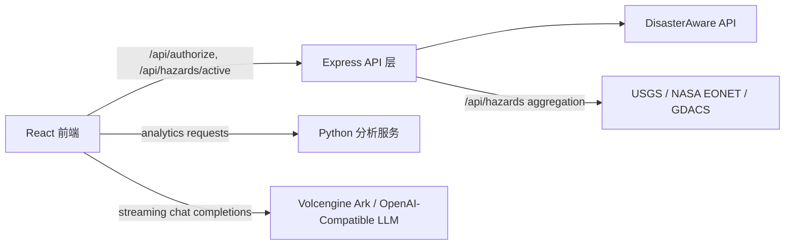
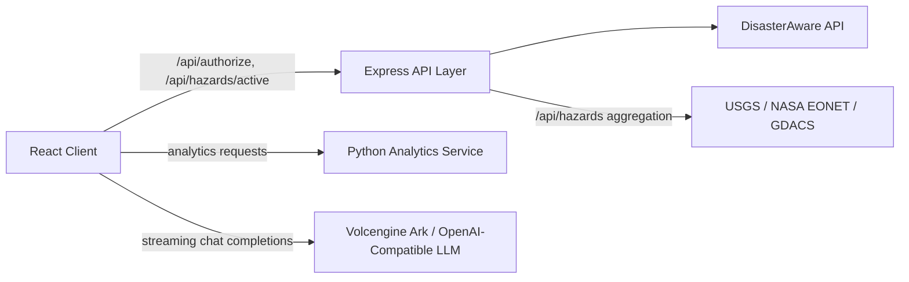

# Prometheus Global Guardian

Languages: [中文](#中文) | [English](#english)

---

## 中文

Prometheus Global Guardian 是一套面向灾害监测、地理态势可视化、数据分析和 AI 辅助研判的全球灾害运营平台。

系统整合实时灾害数据源，统一事件数据结构，在交互式地图上呈现全球态势，并为风险复盘、报告导出和应急决策提供分析工作流。

### 目录

- [平台概览](#平台概览)
- [核心能力](#核心能力)
- [系统架构](#系统架构)
- [服务拓扑](#服务拓扑)
- [技术栈](#技术栈)
- [运行环境](#运行环境)
- [配置](#配置)
- [本地开发](#本地开发)
- [Python 分析服务](#python-分析服务)
- [AI 助手模型服务](#ai-助手模型服务)
- [生产构建](#生产构建)
- [API 接口](#api-接口)
- [数据源](#数据源)
- [运维说明](#运维说明)
- [安全说明](#安全说明)
- [项目结构](#项目结构)

### 平台概览

平台围绕四个核心运营域构建：

- **灾害数据接入**：接入 DisasterAware、USGS、NASA EONET、GDACS 等灾害数据源。
- **地理态势展示**：通过 Mapbox GL 展示灾害标记、热力图、聚合图层和 3D 建筑图层。
- **分析与报告**：提供统计汇总、图表分析、风险评估、数据质量检查和报告导出。
- **AI 辅助研判**：将实时灾害上下文注入大模型助手，生成结构化态势分析和响应建议。

平台由 React 前端、轻量 Express API 层、Python FastAPI 分析服务，以及外部数据和模型服务共同组成。

### 核心能力

#### 全球灾害监测

- 多源活跃灾害事件可视化，覆盖权威公共数据源和 DisasterAware 接口。
- 支持按灾害类型筛选，包括地震、火山、洪水、野火、风暴、干旱、海啸和滑坡。
- 使用统一的 `Hazard` 数据结构支撑地图渲染、分析、AI 上下文和报告导出。
- 使用 Web Worker 清洗灾害数据，降低主线程压力。

#### 地理态势可视化

- 基于 Mapbox GL 的交互式全球地图。
- 支持灾害标记、弹窗详情和热力图模式。
- 使用 LOD 聚合策略优化中低缩放层级的点位展示。
- 可选接入 deck.gl 和 loaders.gl 的 3D Tiles 图层。
- 支持切换 Mapbox 底图样式。

#### 分析工作台

- 展示活跃灾害记录的统计概览。
- 使用 Recharts 渲染类型分布、严重程度分布、时间趋势和数据源分布。
- 通过 Python 服务提供统计分析、预测分析、风险评估、ETL 和数据质量检查。
- 分析页面包含服务健康状态、加载状态、错误处理、重试和分析缓存控制。

#### AI 辅助研判

- 支持流式 LLM 对话体验。
- 自动将当前灾害上下文注入 System Prompt。
- 提供全球态势、洪水、地震、野火、趋势预测、应急响应等快捷分析入口。
- 未配置模型 Key 时自动进入本地 Demo 降级模式。
- 优先支持火山方舟（Volcengine Ark）OpenAI-compatible Chat Completions 接口。
- 保留通用 OpenAI-format 模型服务兼容能力。

#### 报告与通知

- 支持基于筛选数据生成 HTML 灾害报告。
- 通知中心使用内存单例管理器和订阅 API。
- 浏览器通知权限允许时可触发系统通知。
- 提供设置、报告、分析和 AI 助手等模态工作流。

### 系统架构



Express 层当前负责生产环境静态资源托管、DisasterAware API 代理，以及 `/api/hazards` 多源灾害数据聚合。

Python 分析服务作为独立 FastAPI 进程运行，默认端口为 `8001`。

### 服务拓扑

| 服务 | 运行时 | 默认端口 | 职责 |
|---|---:|---:|---|
| React / Vite client | Node.js | 5173 | 本地开发前端服务 |
| Express server | Node.js | 8080 | 生产静态托管、API 代理、灾害聚合 |
| Python analytics service | Python 3.13 | 8001 | 统计、预测、ETL、风险和数据质量接口 |
| External LLM provider | SaaS | HTTPS | AI 对话补全和流式响应 |

### 技术栈

#### 前端

| 技术 | 用途 |
|---|---|
| React 19 | UI 组件和渲染 |
| TypeScript 5.9 | 静态类型和应用契约 |
| Vite 7 | 开发服务和生产构建 |
| Mapbox GL | 交互式地图渲染 |
| deck.gl / loaders.gl | 可选 3D Tiles 集成 |
| Recharts | 分析图表 |
| DOMPurify | AI 输出内容净化 |

#### 后端与分析

| 技术 | 用途 |
|---|---|
| Express 5 | API 代理层和生产服务 |
| node-fetch | 服务端外部请求 |
| raw-body | 代理请求体转发 |
| FastAPI | Python 分析 API 服务 |
| Pandas / NumPy | 数据处理和数值计算 |
| SciPy / Statsmodels | 统计分析 |
| Scikit-learn | 预测和建模流程 |

### 运行环境

| 运行时 | 版本 |
|---|---|
| Node.js | 18.x |
| npm | 与 Node 18 兼容 |
| Python | 推荐 3.13，用于分析服务 |

仓库包含 `.nvmrc`，可用以下命令切换 Node 版本：

```bash
nvm use
```

### 配置

创建本地环境变量文件：

```bash
cp .env.example .env
```

#### 必需前端配置

```dotenv
VITE_MAPBOX_TOKEN=pk.your_mapbox_token_here
```

#### 可选 DisasterAware 凭据

```dotenv
VITE_USERNAME=your_username_here
VITE_PASSWORD=your_password_here
```

未配置 DisasterAware 凭据时，应用仍可在支持的场景下使用公共数据源降级。

#### 可选 Python 分析服务地址

```dotenv
VITE_PYTHON_API_URL=http://localhost:8001
```

#### 可选 AI 模型服务配置

```dotenv
VITE_VOLCENGINE_ARK_API_KEY=your_volcengine_ark_api_key_here
VITE_VOLCENGINE_ARK_MODEL=auto
VITE_VOLCENGINE_ARK_API_URL=https://ark.cn-beijing.volces.com/api/v3/chat/completions
```

`VITE_VOLCENGINE_ARK_MODEL` 可以设置为 `auto`，也可以设置为火山方舟控制台中的具体模型或 Endpoint ID。

AI 客户端也兼容通用 OpenAI-format 配置：

```dotenv
VITE_OPENAI_API_KEY=sk-your-key
VITE_OPENAI_MODEL=your-model
VITE_OPENAI_API_URL=https://provider.example.com/v1/chat/completions
```

### 本地开发

安装依赖：

```bash
npm install
```

启动前端开发服务：

```bash
npm run dev
```

访问：

```text
http://localhost:5173
```

运行代码检查：

```bash
npm run lint
```

构建前端：

```bash
npm run build
```

### Python 分析服务

分析服务独立于 React 应用运行，使用分析功能时需要单独启动。

推荐从仓库根目录执行：

```bash
chmod +x start-python-service.sh && ./start-python-service.sh
```

手动启动：

```bash
cd python-analytics-service
python3.13 -m venv venv
source venv/bin/activate
pip install -r requirements.txt
python main.py
```

服务端点：

| URL | 用途 |
|---|---|
| `http://localhost:8001/health` | 健康检查 |
| `http://localhost:8001/docs` | Swagger API 文档 |
| `http://localhost:8001/redoc` | ReDoc API 文档 |

### AI 助手模型服务

AI 助手按以下优先级选择模型服务：

1. 配置了 `VITE_AI_FLOW_API_URL` + `VITE_AI_FLOW_API_KEY` 时，优先使用 ai-flow 工作流。
2. 配置火山方舟变量时，使用 Volcengine Ark。
3. 配置通用 OpenAI-compatible 变量时，使用对应模型服务。
4. 未配置模型 Key 时，使用本地 Demo 响应。

前端直连模型服务适合本地开发和演示。生产环境建议通过服务端代理模型请求，避免模型服务 Key 暴露在浏览器资源中。

### 生产构建

构建客户端：

```bash
npm run build
```

启动生产 Express 服务：

```bash
npm start
```

默认监听地址：

```text
http://localhost:8080
```

仅静态托管：

```bash
npm run start:static
```

### API 接口

#### Express API 层

| 接口 | 方法 | 说明 |
|---|---|---|
| `/api/hazards` | `GET` | 聚合 USGS、NASA EONET 和 GDACS 公共灾害数据 |
| `/api/hazards?source=USGS,NASA` | `GET` | 按数据源筛选聚合结果 |
| `/api/hazards?type=EARTHQUAKE,FLOOD` | `GET` | 按灾害类型筛选聚合结果 |
| `/api/*` | Any | 代理其余 API 到 DisasterAware |

#### Python 分析 API

| 接口 | 方法 | 说明 |
|---|---|---|
| `/health` | `GET` | 服务健康检查 |
| `/api/v1/statistics` | `POST` | 统计分析 |
| `/api/v1/predictions` | `POST` | 预测分析 |
| `/api/v1/risk-assessment` | `POST` | 风险评分和建议 |
| `/api/v1/etl/process` | `POST` | 数据标准化和质量处理 |

### 数据源

| 数据源 | 范围 | 用途 |
|---|---|---|
| DisasterAware | 活跃灾害和灾害类型 API | 已配置凭据时的主要灾害数据源 |
| USGS | 地震 GeoJSON 数据 | 地震降级和聚合数据源 |
| NASA EONET | 环境事件追踪 | 野火、火山、洪水、风暴、干旱、滑坡等事件 |
| GDACS | 全球灾害警报 | 全球警报和协调数据 |

### 运维说明

- Python 分析服务需要在 `VITE_PYTHON_API_URL` 指定地址可用，相关分析流程才可调用 FastAPI 接口。
- Python 服务离线时，前端地图和公共灾害数据流程仍可运行，但分析面板可能显示离线或错误状态。
- `npm start` 通过 Express 托管构建产物，并启用后端 `/api/hazards` 聚合接口。
- `npm run dev` 使用 Vite 开发服务；开发环境下 `/api` 请求由 Vite proxy 处理。
- Mapbox 地图渲染需要有效的 `VITE_MAPBOX_TOKEN`。
- `dist/` 是构建产物，生产发布前应重新构建。

### 安全说明

- `.env` 已被 git 忽略，不能提交。
- 以 `VITE_` 开头的变量会暴露到浏览器构建产物中，不应放置生产级敏感密钥。
- 生产环境使用 AI 服务时，建议通过服务端代理火山方舟或其他模型服务请求。
- 生产部署前应审查 `server.js` 的代理日志；当前日志有助于诊断，但可能输出敏感请求头或请求体。
- DisasterAware 凭据和模型服务 Key 应由部署平台的密钥管理能力托管。

### 项目结构

```text
prometheus-global-guardian/
├── public/
│   └── assets/
├── python-analytics-service/
│   ├── analytics/
│   │   ├── etl_processor.py
│   │   ├── pivot_table_analyzer.py
│   │   ├── prediction_models.py
│   │   ├── quality_monitor.py
│   │   ├── risk_assessment.py
│   │   ├── statistical_algorithms.py
│   │   └── unified_model.py
│   ├── main.py
│   ├── requirements.txt
│   └── start.sh
├── src/
│   ├── api/
│   │   ├── aiAssistant.ts
│   │   ├── aiProviderConfig.ts
│   │   ├── auth.ts
│   │   ├── disasteraware.ts
│   │   ├── hazards.ts
│   │   └── pythonAnalytics.ts
│   ├── components/
│   ├── config/
│   ├── types/
│   ├── utils/
│   ├── workers/
│   ├── App.tsx
│   ├── index.css
│   └── index.tsx
├── hazards-source.js
├── server.js
├── start-python-service.sh
├── Dockerfile
├── package.json
└── vite.config.ts
```

### 许可证

MIT

---

## English

Prometheus Global Guardian is an operational platform for global hazard monitoring, geospatial visualization, analytics, and AI-assisted incident assessment.

The system consolidates live hazard feeds, normalizes event data, renders global situational awareness on an interactive map, and provides analytical workflows for risk review, reporting, and decision support.

### Table of Contents

- [Platform Overview](#platform-overview)
- [Core Capabilities](#core-capabilities)
- [System Architecture](#system-architecture)
- [Service Topology](#service-topology)
- [Technology Stack](#technology-stack)
- [Runtime Requirements](#runtime-requirements)
- [Configuration](#configuration)
- [Local Development](#local-development)
- [Python Analytics Service](#python-analytics-service)
- [AI Assistant Provider](#ai-assistant-provider)
- [Production Build](#production-build)
- [API Surface](#api-surface)
- [Data Sources](#data-sources)
- [Operational Notes](#operational-notes)
- [Security Notes](#security-notes)
- [Project Structure](#project-structure)

### Platform Overview

The platform is organized around four operational domains:

- **Hazard ingestion**: integrates DisasterAware, USGS, NASA EONET, and GDACS feeds.
- **Geospatial operations**: presents active events through Mapbox GL, markers, heatmap mode, clustering, and 3D building layers.
- **Analytics and reporting**: provides statistical summaries, charting, risk assessment, data quality checks, and exportable reports.
- **AI-assisted analysis**: injects live hazard context into an LLM assistant for structured situation summaries and response recommendations.

The platform consists of a React frontend, a lightweight Express API layer, a Python FastAPI analytics service, and external data/model providers.

### Core Capabilities

#### Global Hazard Monitoring

- Visualizes active disaster events across multiple authoritative sources.
- Supports hazard filtering by earthquake, volcano, flood, wildfire, storm, drought, tsunami, and landslide.
- Uses a unified `Hazard` data model across mapping, analytics, AI context, and reporting.
- Cleans hazard data through a Web Worker to reduce UI thread pressure.

#### Geospatial Visualization

- Interactive global map powered by Mapbox GL.
- Supports event markers, contextual popups, and heatmap mode.
- Uses LOD clustering for mid and low zoom levels.
- Provides optional 3D Tiles overlays through deck.gl and loaders.gl.
- Supports configurable Mapbox base map styles.

#### Analytics Workspace

- Presents statistical summaries of active hazard records.
- Renders type, severity, timeline, and source distribution charts with Recharts.
- Uses the Python service for statistics, predictions, risk assessment, ETL, and data quality checks.
- Includes service health, loading, error, retry, and cached-analysis states.

#### AI-Assisted Incident Analysis

- Provides a streaming LLM chat interface.
- Injects current hazard context into the system prompt.
- Offers quick prompts for global situation review, flood risk, seismic activity, wildfire threat, forecasting, and emergency response.
- Falls back to local demo responses when no model key is configured.
- Prioritizes Volcengine Ark through an OpenAI-compatible Chat Completions endpoint.
- Retains compatibility with generic OpenAI-format providers.

#### Reporting and Notifications

- Generates HTML reports from filtered hazard data.
- Uses an in-memory singleton notification manager with a subscription API.
- Integrates browser notifications when permission is granted.
- Provides modal workflows for settings, reporting, analytics, and AI assistance.

### System Architecture



The Express layer currently handles production static hosting, DisasterAware API proxying, and multi-source hazard aggregation under `/api/hazards`.

The Python analytics service runs as an independent FastAPI process on port `8001` by default.

### Service Topology

| Service | Runtime | Default Port | Responsibility |
|---|---:|---:|---|
| React / Vite client | Node.js | 5173 | Frontend development server |
| Express server | Node.js | 8080 | Static hosting, API proxying, hazard aggregation |
| Python analytics service | Python 3.13 | 8001 | Statistics, prediction, ETL, risk, quality APIs |
| External LLM provider | SaaS | HTTPS | Chat completion and streaming response |

### Technology Stack

#### Frontend

| Technology | Purpose |
|---|---|
| React 19 | Component model and UI rendering |
| TypeScript 5.9 | Static typing and application contracts |
| Vite 7 | Development server and production build |
| Mapbox GL | Interactive map rendering |
| deck.gl / loaders.gl | Optional 3D Tiles integration |
| Recharts | Analytics visualizations |
| DOMPurify | Sanitization for rendered assistant output |

#### Backend and Analytics

| Technology | Purpose |
|---|---|
| Express 5 | API proxy layer and production app server |
| node-fetch | Server-side requests to external providers |
| raw-body | Request body forwarding for proxied API calls |
| FastAPI | Python analytics API service |
| Pandas / NumPy | Data processing and numerical computation |
| SciPy / Statsmodels | Statistical analysis |
| Scikit-learn | Prediction and modeling workflows |

### Runtime Requirements

| Runtime | Version |
|---|---|
| Node.js | 18.x |
| npm | Compatible with Node 18 |
| Python | 3.13 recommended for analytics |

The repository includes `.nvmrc`; use the following command to switch Node versions:

```bash
nvm use
```

### Configuration

Create a local environment file:

```bash
cp .env.example .env
```

#### Required Frontend Configuration

```dotenv
VITE_MAPBOX_TOKEN=pk.your_mapbox_token_here
```

#### Optional DisasterAware Credentials

```dotenv
VITE_USERNAME=your_username_here
VITE_PASSWORD=your_password_here
```

When DisasterAware credentials are unavailable, the application can still use public feed fallbacks where supported.

#### Optional Python Analytics Endpoint

```dotenv
VITE_PYTHON_API_URL=http://localhost:8001
```

#### Optional AI Provider Configuration

```dotenv
VITE_VOLCENGINE_ARK_API_KEY=your_volcengine_ark_api_key_here
VITE_VOLCENGINE_ARK_MODEL=auto
VITE_VOLCENGINE_ARK_API_URL=https://ark.cn-beijing.volces.com/api/v3/chat/completions
```

`VITE_VOLCENGINE_ARK_MODEL` may be set to `auto` or to a concrete model / endpoint ID from the Volcengine Ark console.

The AI client also supports generic OpenAI-format configuration:

```dotenv
VITE_OPENAI_API_KEY=sk-your-key
VITE_OPENAI_MODEL=your-model
VITE_OPENAI_API_URL=https://provider.example.com/v1/chat/completions
```

### Local Development

Install dependencies:

```bash
npm install
```

Start the frontend development server:

```bash
npm run dev
```

Open:

```text
http://localhost:5173
```

Run linting:

```bash
npm run lint
```

Build the frontend:

```bash
npm run build
```

### Python Analytics Service

The analytics service runs independently from the React application and must be started separately when analytics features are required.

Recommended command from the repository root:

```bash
chmod +x start-python-service.sh && ./start-python-service.sh
```

Manual startup:

```bash
cd python-analytics-service
python3.13 -m venv venv
source venv/bin/activate
pip install -r requirements.txt
python main.py
```

Service endpoints:

| URL | Purpose |
|---|---|
| `http://localhost:8001/health` | Health check |
| `http://localhost:8001/docs` | Swagger API documentation |
| `http://localhost:8001/redoc` | ReDoc API documentation |

### AI Assistant Provider

The AI assistant selects providers in this order:

1. Uses ai-flow when `VITE_AI_FLOW_API_URL` + `VITE_AI_FLOW_API_KEY` are configured.
2. Uses Volcengine Ark when Ark variables are configured.
3. Uses a generic OpenAI-compatible provider when configured.
4. Falls back to local demo responses when no model key is configured.

Direct browser-based model configuration is convenient for local development and demos. For production usage, route model calls through a server-side endpoint so provider keys are not exposed in browser assets.

### Production Build

Build the client:

```bash
npm run build
```

Start the production Express server:

```bash
npm start
```

Default server URL:

```text
http://localhost:8080
```

Static-only hosting:

```bash
npm run start:static
```

### API Surface

#### Express API Layer

| Endpoint | Method | Description |
|---|---|---|
| `/api/hazards` | `GET` | Aggregates public hazard feeds from USGS, NASA EONET, and GDACS |
| `/api/hazards?source=USGS,NASA` | `GET` | Filters aggregation by source |
| `/api/hazards?type=EARTHQUAKE,FLOOD` | `GET` | Filters aggregation by hazard type |
| `/api/*` | Any | Proxies remaining API calls to DisasterAware |

#### Python Analytics API

| Endpoint | Method | Description |
|---|---|---|
| `/health` | `GET` | Service health check |
| `/api/v1/statistics` | `POST` | Statistical analysis |
| `/api/v1/predictions` | `POST` | Predictive analysis |
| `/api/v1/risk-assessment` | `POST` | Risk scoring and recommendations |
| `/api/v1/etl/process` | `POST` | Data normalization and quality processing |

### Data Sources

| Source | Scope | Usage |
|---|---|---|
| DisasterAware | Active hazard and type APIs | Primary authenticated provider |
| USGS | Earthquake GeoJSON feeds | Earthquake fallback and aggregation source |
| NASA EONET | Environmental event tracking | Wildfire, volcano, flood, storm, drought, landslide events |
| GDACS | Global disaster alerts | Global alert and coordination data |

### Operational Notes

- The Python analytics service must be available at `VITE_PYTHON_API_URL` for workflows that call FastAPI endpoints.
- When the Python service is offline, map and public hazard workflows can still run, while analytics panels may show offline or error states.
- `npm start` serves the built app through Express and enables the backend `/api/hazards` aggregation endpoint.
- `npm run dev` uses Vite for frontend development; `/api` requests are handled by the Vite proxy in development.
- Mapbox rendering requires a valid `VITE_MAPBOX_TOKEN`.
- `dist/` is generated output and should be rebuilt for production releases.

### Security Notes

- `.env` is ignored by git and must not be committed.
- Variables prefixed with `VITE_` are exposed to browser assets; do not place production-only secrets there.
- For production AI usage, prefer a server-side proxy for Volcengine Ark or other model providers.
- Review proxy logging in `server.js` before production deployment; current logs are useful for diagnostics but may expose sensitive headers or payloads.
- DisasterAware credentials and model provider keys should be managed through deployment secret storage.

### Project Structure

```text
prometheus-global-guardian/
├── public/
│   └── assets/
├── python-analytics-service/
│   ├── analytics/
│   │   ├── etl_processor.py
│   │   ├── pivot_table_analyzer.py
│   │   ├── prediction_models.py
│   │   ├── quality_monitor.py
│   │   ├── risk_assessment.py
│   │   ├── statistical_algorithms.py
│   │   └── unified_model.py
│   ├── main.py
│   ├── requirements.txt
│   └── start.sh
├── src/
│   ├── api/
│   │   ├── aiAssistant.ts
│   │   ├── aiProviderConfig.ts
│   │   ├── auth.ts
│   │   ├── disasteraware.ts
│   │   ├── hazards.ts
│   │   └── pythonAnalytics.ts
│   ├── components/
│   ├── config/
│   ├── types/
│   ├── utils/
│   ├── workers/
│   ├── App.tsx
│   ├── index.css
│   └── index.tsx
├── hazards-source.js
├── server.js
├── start-python-service.sh
├── Dockerfile
├── package.json
└── vite.config.ts
```

### License

MIT
