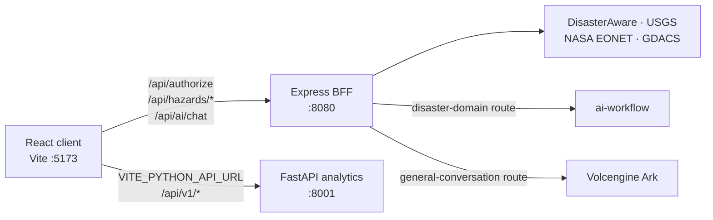
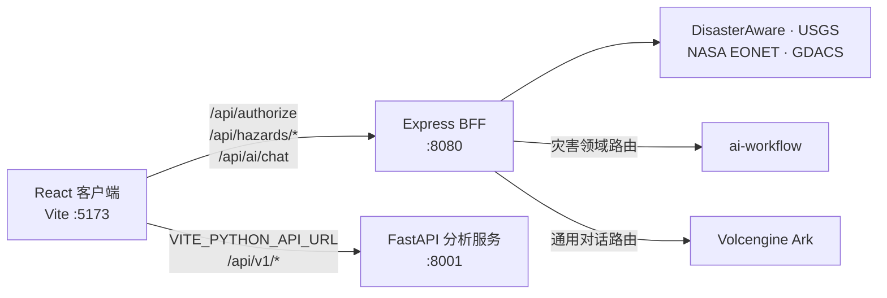

# Prometheus Global Guardian

Languages: [English](#english) | [中文](#中文)

---

## English

Prometheus Global Guardian is a local development project for global hazard monitoring, geospatial visualization, analytics, and AI-assisted incident assessment. It combines live hazard feeds into a shared model, displays the resulting situation on an interactive map, and provides analysis, reporting, and decision-support workflows.

The repository contains a React client, an Express BFF, a FastAPI analytics service, and integrations with external data and AI providers. It is not currently deployed. Docker Compose is supplied only to run the complete stack locally.

### Table of Contents

- [Platform Overview](#platform-overview)
- [Core Capabilities](#core-capabilities)
- [Architecture and Data Flow](#architecture-and-data-flow)
- [Service Topology](#service-topology)
- [Technology Stack](#technology-stack)
- [Runtime Requirements](#runtime-requirements)
- [Configuration](#configuration)
- [Local Development](#local-development)
- [Testing and Quality](#testing-and-quality)
- [Docker Compose](#docker-compose)
- [Python Analytics Service](#python-analytics-service)
- [AI Assistant Provider](#ai-assistant-provider)
- [Local Production Build](#local-production-build)
- [API Surface](#api-surface)
- [Data Sources](#data-sources)
- [Operational Notes](#operational-notes)
- [Security Notes](#security-notes)
- [Project Structure](#project-structure)

### Platform Overview

The platform is organized around four operational domains:

- **Hazard ingestion**: combines DisasterAware with USGS, NASA EONET, and GDACS feeds and normalizes them into `Hazard` records.
- **Geospatial operations**: renders active events with Mapbox GL markers, popups, heatmap mode, clustering, optional 3D Tiles, and configurable base styles.
- **Analytics and reporting**: presents summaries, charts, risk and quality results from the Python service, then exports the current filtered hazards as a JSON report.
- **AI-assisted analysis**: sends live hazard context through a streaming BFF endpoint for situation summaries and response recommendations.

### Core Capabilities

#### Global Hazard Monitoring

- Displays active events from multiple authoritative or public sources.
- Filters earthquake, volcano, flood, wildfire, storm, drought, tsunami, and landslide records.
- Uses one `Hazard` model across mapping, analytics, AI context, and report export.
- Cleans and transforms hazard data in a Web Worker to reduce UI-thread pressure.
- Maintains cancellation and stale-response protection as filters or refreshes change.

#### Geospatial Visualization

- Interactive global map powered by Mapbox GL.
- Event markers, contextual popups, heatmap rendering, and zoom-sensitive clustering.
- Optional deck.gl / loaders.gl 3D Tiles overlay; Mapbox fill-extrusion buildings are the fallback when no tiles URL is configured.
- User-selectable Mapbox base style.

#### Analytics Workspace

- Statistical summaries plus type, severity, timeline, and source distribution charts.
- FastAPI-backed statistics, prediction, risk assessment, ETL, data quality, unified-model, and pivot workflows.
- Health, loading, cached-result, retry, empty-data, and error states.
- Typed presentation adapters for prediction availability, sample requirements, confidence, risk levels, trends, and quality scores.
- `zh-CN` and `en-US` result copy without changing the Python API response shape.

#### AI-Assisted Incident Analysis

- Streaming chat interface with current hazards inserted as context.
- Quick prompts for global review, floods, seismic activity, wildfire threat, forecasting, and emergency response.
- BFF smart routing: disaster-domain questions can use ai-workflow; general conversation can use Volcengine Ark.
- Forced provider modes and a local demo fallback when no provider key is configured.
- Closing the assistant cancels its active stream. App-level Escape closes only report and settings modals; the AI component handles Escape itself to close and cancel its active stream.

#### Reporting and Notifications

- Downloads a JSON report containing the report name, selected filter, current hazards, and export timestamp.
- Provides in-memory notification subscriptions and optional browser notifications when permission is granted.
- Includes settings, report, analytics, and AI workflows.

### Architecture and Data Flow



In local development, Vite serves the browser client on port `5173` and proxies `/api/*` to Express on `8080`. The browser directly calls FastAPI at `VITE_PYTHON_API_URL` (default `http://localhost:8001`) for `/api/v1/*` analytics requests. Express handles DisasterAware authorization, public-feed aggregation, and AI provider routing. Browser assets never receive DisasterAware credentials, upstream access tokens, or model-provider secrets.

Frontend state ownership is deliberately small and explicit:

- `MapStateProvider` owns hazards, the hazard filter, map style, source metadata, and refresh behavior. It retains the data hook's worker lifecycle, cancellation, and stale-response protection.
- `UIStateProvider` owns `activeView` (`map` or `analytics`) and `activeModal` (`save-report`, `settings`, `ai`, or `null`).
- `App` only performs initial authorization, composes providers, handles Escape for report/settings modals, and selects the map or analytics view. Mapbox instances, AI session state, and analytics-fetch state remain in their feature boundaries.

### Service Topology

| Service                        | Runtime | Default port | Responsibility                                              |
| ------------------------------ | ------: | -----------: | ----------------------------------------------------------- |
| React / Vite client            | Node.js |         5173 | Local frontend development server                           |
| Express BFF                    | Node.js |         8080 | Static files, authorization, hazard aggregation, AI routing |
| Python analytics service       |  Python |         8001 | Analysis, prediction, risk, ETL, quality, and pivot APIs    |
| External data and AI providers |    SaaS |        HTTPS | Hazard feeds and streaming model responses                  |

### Technology Stack

#### Frontend

| Technology              | Purpose                                          |
| ----------------------- | ------------------------------------------------ |
| React 19 and TypeScript | Components, UI state, and application contracts  |
| Vite                    | Local development server and build               |
| Mapbox GL               | Interactive mapping                              |
| deck.gl / loaders.gl    | Optional 3D Tiles integration                    |
| Recharts                | Analytics visualizations                         |
| DOMPurify               | Sanitization before assistant output is rendered |

#### Backend and Analytics

| Technology          | Purpose                                   |
| ------------------- | ----------------------------------------- |
| Express 5           | BFF and local static application server   |
| FastAPI             | Python analytics HTTP service             |
| Pandas / NumPy      | Data processing and numerical computation |
| SciPy / Statsmodels | Statistical analysis                      |
| Scikit-learn        | Prediction and modeling workflows         |

### Runtime Requirements

| Runtime | Version                        |
| ------- | ------------------------------ |
| Node.js | `20.19.x` in the 20.x line     |
| pnpm    | `10.15.1`                      |
| Python  | 3.13 recommended for analytics |

The repository contains `.nvmrc`. Project scripts use `scripts/with-node-version.sh` to select that version when nvm is available. Docker images already provide Node.js 20.19.0.

### Configuration

Create a local environment file before starting services:

```bash
cp .env.example .env
```

#### Frontend values

```dotenv
VITE_MAPBOX_TOKEN=pk.your_mapbox_token_here
VITE_LOG_LEVEL=debug
VITE_PYTHON_API_URL=http://localhost:8001
VITE_3D_TILES_URL=
VITE_CESIUM_ION_TOKEN=
```

`VITE_` values are embedded in browser assets at build time. Use them only for public configuration; rebuild after changing them.

#### BFF and external-provider values

```dotenv
DISASTERAWARE_USERNAME=your_username_here
DISASTERAWARE_PASSWORD=your_password_here
DISASTERAWARE_REQUEST_TIMEOUT_MS=10000
BFF_AUTHORIZE_RATE_LIMIT_MAX=10
BFF_AI_RATE_LIMIT_MAX=30
BFF_HAZARD_RATE_LIMIT_MAX=120
LOG_LEVEL=info

AI_PROVIDER=router
VOLCENGINE_WORKFLOW_API_URL=http://localhost:3100/api/v1/apps/run
VOLCENGINE_WORKFLOW_API_KEY=
VOLCENGINE_ARK_API_KEY=
VOLCENGINE_ARK_MODEL=ark-code-latest
VOLCENGINE_ARK_API_URL=https://ark.cn-beijing.volces.com/api/plan/v3
VOLCENGINE_ARK_TIMEOUT_MS=30000
```

These values are read by Express at runtime and must never use a `VITE_` prefix. `AI_PROVIDER=router` enables smart routing; use `workflow` or `ark` to force one provider while troubleshooting. If the workflow runs on the macOS host while Express runs in Docker, set its URL to `http://host.docker.internal:3100/api/v1/apps/run`.

#### Analytics administration values

```dotenv
ANALYTICS_ADMIN_TOKEN=
ANALYTICS_CORS_ORIGINS=
APP_ENV=production
```

`ANALYTICS_ADMIN_TOKEN` enables Python management routes and must stay server-side. `ANALYTICS_CORS_ORIGINS` is a comma-separated allowlist for non-local browser origins. See the [Python Analytics Service README](python-analytics-service/README.md) for the complete boundary and request contract.

#### Logging and diagnostic output

`VITE_LOG_LEVEL` and `LOG_LEVEL` accept `debug`, `info`, `warn`, `error`, and `silent`. Browser development defaults to `debug`, browser production to `warn`, and BFF/Python production to `info`. Logs use safe event context such as status, duration, count, and request ID. Do not log credentials, tokens, headers, request/response bodies, exception messages, or stacks.

### Local Development

Install dependencies:

```bash
pnpm install
```

Start the Express BFF in one terminal:

```bash
pnpm run build:server
node dist-server/server.js
```

Start the frontend in another terminal:

```bash
pnpm run dev
```

Open `http://localhost:5173`. Start the Python service whenever analytics features are needed:

```bash
./scripts/start-python-service.sh
```

### Testing and Quality

Run the relevant layer while developing:

```bash
pnpm run test:services
pnpm run test:component
pnpm run test:python
```

The current automated suites contain 177 frontend Service tests, 59 React component tests, and 39 Python unittest cases. They cover request and contract boundaries, hazard transformation, analytics presentation, AI streaming, map/UI state ownership, FastAPI routes, and analysis-result semantics. Component tests use Vitest, React Testing Library, and jsdom; Python tests do not require a running analytics service or real external data.

Useful commands:

```bash
pnpm test
pnpm run test:bff
pnpm run test:e2e
pnpm run test:baseline
pnpm run lint
pnpm run format:check
pnpm run typecheck:client
pnpm run typecheck:server
pnpm run build
```

`pnpm test` runs the BFF and Service unit groups. In restricted sandboxes, the BFF subset can fail with `listen EPERM: operation not permitted 0.0.0.0` because Node cannot bind a local test port; this is an environment limitation. Run component, Service, and Python commands separately when that restriction applies. CI runs the Node quality baseline and Python test job; see [docs/TESTING_BASELINE.md](docs/TESTING_BASELINE.md) for command boundaries.

### Docker Compose

Docker Compose is a **local complete-stack startup** path. It does not represent a deployment configuration.

```bash
docker compose up --build
```

Open `http://localhost:8080` and check FastAPI at `http://localhost:8001/health`. Stop with `docker compose down`, inspect with `docker compose ps`, and follow output with `docker compose logs -f`.

The web container exposes 8080. Analytics is mapped as `127.0.0.1:8001:8001`, so it is not exposed to the local network. Compose passes public `VITE_*` build values to the client build; DisasterAware and AI values remain Express runtime variables. Keep `VITE_PYTHON_API_URL=http://localhost:8001` when using Compose because analytics calls originate in the host browser.

### Python Analytics Service

FastAPI is an independent local service. Its public endpoints include `/`, `/health`, `/docs`, and `/redoc`; browser analytics requests use `/api/v1/*`. `/metrics` and `/cache/clear` are disabled until `ANALYTICS_ADMIN_TOKEN` is set, then require the `X-Analytics-Admin-Token` header.

Read [python-analytics-service/README.md](python-analytics-service/README.md) for startup instructions, request format, endpoint groups, analysis semantics, and the Python test suite.

### AI Assistant Provider

The browser sends chat requests only to `POST /api/ai/chat`. Express validates the request and streams an adapted response back to the assistant. With `AI_PROVIDER=router`, disaster knowledge, emergency plans, historical cases, and live hazard analysis can go to ai-workflow; general conversation can go to Volcengine Ark. The BFF supports Ark's OpenAI-compatible Chat Completions and Responses protocols. Without a configured provider key, the frontend uses its local demo fallback.

### Local Production Build

Build the client and Express BFF artifacts:

```bash
pnpm run build
```

Start the locally built application server:

```bash
pnpm start
```

It listens on `http://localhost:8080` by default. `pnpm run start:static` serves only the static client. These commands support local verification; this repository currently has no deployment workflow.

### API Surface

#### Express BFF

| Endpoint                           | Method | Purpose                                                                          |
| ---------------------------------- | ------ | -------------------------------------------------------------------------------- |
| `/api/authorize`                   | `POST` | Uses server-side DisasterAware credentials and returns authorization status only |
| `/api/hazards`                     | `GET`  | Aggregates public hazard feeds; supports `source` and `type` filters             |
| `/api/ai/chat`                     | `POST` | Streams AI assistant responses through the BFF                                   |
| `/api/hazards/types`               | `GET`  | Proxies the authenticated DisasterAware type endpoint                            |
| `/api/hazards/active`              | `GET`  | Proxies authenticated active hazards                                             |
| `/api/hazards/active/category/:id` | `GET`  | Proxies authenticated category hazards                                           |
| Other `/api/*`                     | Any    | Returns a stable 404 or 405; arbitrary upstream proxying is not supported        |

#### Python analytics

| Group                     | Endpoints                                                                                                                                                             |
| ------------------------- | --------------------------------------------------------------------------------------------------------------------------------------------------------------------- |
| Service and management    | `GET /`, `GET /health`, `GET /metrics`, `POST /cache/clear`                                                                                                           |
| Basic analysis            | `POST /api/v1/analyze`, `/statistics`, `/predictions`, `/risk-assessment`, `/etl/process`                                                                             |
| Quality and unified model | `POST /api/v1/quality/assess`, `GET /api/v1/quality/thresholds`, `GET /api/v1/quality/history`, `POST /api/v1/unified-model/transform`, `/api/v1/unified-model/merge` |
| Pivot workflows           | `POST /api/v1/pivot/create`, `/query`, `/trend-analysis`, `/risk-score`, `/summary`                                                                                   |

### Data Sources

| Source        | Scope                       | Use                                                          |
| ------------- | --------------------------- | ------------------------------------------------------------ |
| DisasterAware | Active hazard and type APIs | Authenticated primary source when credentials are available  |
| USGS          | Earthquake GeoJSON          | Fallback and aggregation source                              |
| NASA EONET    | Environmental events        | Wildfire, volcano, flood, storm, drought, and landslide data |
| GDACS         | Global alerts               | Alert and coordination data                                  |

### Operational Notes

- The map and public-hazard workflow can work when FastAPI is offline; analytics panels show their own offline or error states.
- A valid `VITE_MAPBOX_TOKEN` is required for Mapbox rendering.
- `dist/` and `dist-server/` are generated local build artifacts.
- New feature work uses an isolated Git worktree by default. Behavior changes follow TDD: a failing test first, minimal implementation, then test-protected refactoring.
- The current project state is local development and quality governance, not deployment.

### Security Notes

- `.env` is ignored by Git and must not be committed.
- Never place server secrets under `VITE_`; those values become browser-visible build inputs.
- The BFF allowlists DisasterAware routes and headers, limits request bodies, validates query shapes, applies process-local rate limits, and returns sanitized upstream errors.
- Management tokens, DisasterAware credentials, and model-provider keys stay in server environments and out of logs, frontend bundles, and JSON reports.

### Project Structure

```text
prometheus-global-guardian/
├── src/
│   ├── features/
│   │   ├── map/                 # Map page, Mapbox hooks, worker, and MapStateProvider
│   │   └── analytics/           # Analytics page, tabs, data hook, and transformations
│   ├── state/                   # UIStateProvider and UI state contracts
│   ├── services/                # Frontend HTTP, hazard, AI, auth, and analytics boundaries
│   ├── components/              # Shared React components and modals
│   ├── workers/                 # Hazard processing Web Worker
│   └── App.tsx                  # Authorization and provider/view composition
├── server/
│   ├── ai/                      # Provider selection, routing, and stream adaptation
│   ├── hazards/                 # Public-feed aggregation
│   └── security/                # BFF request boundaries
├── python-analytics-service/
│   ├── app/                     # FastAPI factory, routes, schemas, and services
│   ├── analytics/               # Statistics, prediction, risk, quality, ETL, and pivot logic
│   └── tests/                   # Python unittest suite
├── tests/                       # BFF, Service, component, and E2E tests
├── docs/                        # Governance, test baseline, plans, and specifications
├── scripts/                     # Node-version, Python-test, and service-start scripts
├── server.ts                    # Express application entry
├── docker-compose.yml           # Local complete-stack startup
└── AGENTS.md                    # Development, worktree, TDD, and validation conventions
```

---

## 中文

Prometheus Global Guardian 是一个用于本地开发的全球灾害监测、地理态势可视化、数据分析和 AI 辅助研判项目。它把实时灾害数据源统一为共享模型，在交互式地图上呈现态势，并提供风险复盘、分析、报告和决策支持工作流。

仓库包含 React 前端、Express BFF、FastAPI 分析服务，以及外部数据源和 AI 服务集成。当前未部署；Docker Compose 仅用于在本地启动完整技术栈。

### 目录

- [平台概览](#平台概览)
- [核心能力](#核心能力)
- [架构与数据流](#架构与数据流)
- [服务拓扑](#服务拓扑)
- [技术栈](#技术栈)
- [运行环境](#运行环境)
- [配置](#配置)
- [本地开发](#本地开发)
- [测试与质量](#测试与质量)
- [Docker Compose](#docker-compose-1)
- [Python 分析服务](#python-分析服务)
- [AI 助手服务](#ai-助手服务)
- [本地生产构建](#本地生产构建)
- [API 接口](#api-接口)
- [数据源](#数据源)
- [运行说明](#运行说明)
- [安全说明](#安全说明)
- [项目结构](#项目结构)

### 平台概览

平台围绕四个业务域组织：

- **灾害接入**：整合 DisasterAware、USGS、NASA EONET 和 GDACS，并统一为 `Hazard` 记录。
- **地理态势**：以 Mapbox GL 呈现活动事件、标记、弹窗、热力图、聚合、可选 3D Tiles 和可配置底图。
- **分析与报告**：调用 Python 服务呈现统计、图表、风险和质量结果，并把当前筛选后的灾害数据导出为 JSON 报告。
- **AI 辅助研判**：将实时灾害上下文送入流式 BFF 接口，生成态势摘要和响应建议。

### 核心能力

#### 全球灾害监测

- 展示多个权威或公开数据源的活动事件。
- 筛选地震、火山、洪水、野火、风暴、干旱、海啸和滑坡。
- 地图、分析、AI 上下文和报告导出共用 `Hazard` 模型。
- 通过 Web Worker 清洗和转换灾害数据，减少 UI 线程压力。
- 筛选或刷新改变时保留请求取消和陈旧响应保护。

#### 地理态势可视化

- 基于 Mapbox GL 的交互式全球地图。
- 事件标记、上下文弹窗、热力图和随缩放变化的聚合。
- 支持 deck.gl / loaders.gl 3D Tiles；未配置 Tiles 时可回退至 Mapbox 建筑挤出层。
- 可选择 Mapbox 底图样式。

#### 分析工作台

- 展示统计摘要，以及类型、严重程度、时间线和数据源分布图表。
- 通过 FastAPI 执行统计、预测、风险评估、ETL、数据质量、统一模型和透视分析。
- 覆盖服务健康、加载、缓存、重试、空数据和错误状态。
- 以类型化展示适配器处理预测可用性、样本要求、置信度、风险等级、趋势和质量分数。
- 提供 `zh-CN` 与 `en-US` 文案资源，而不改变 Python API 响应结构。

#### AI 辅助研判

- 流式聊天界面会注入当前灾害上下文。
- 提供全球态势、洪水风险、地震活动、野火威胁、预测和应急响应等快捷提示。
- BFF 智能路由可把灾害领域问题送给 ai-workflow，把通用对话送给火山方舟。
- 支持强制指定 Provider；未配置模型 Key 时使用本地演示回复。
- 关闭助手会取消正在进行的流。App 级 Escape 只关闭报告和设置弹窗；AI 组件自身处理 Escape，关闭助手并取消正在进行的流。

#### 报告与通知

- 下载 JSON 报告，其中包括报告名称、筛选条件、当前灾害和导出时间。
- 提供内存通知订阅，浏览器授予权限后可使用系统通知。
- 包含设置、报告、分析和 AI 工作流。

### 架构与数据流



本地开发时，Vite 在 `5173` 提供浏览器客户端，并把 `/api/*` 转发到 `8080` 的 Express。浏览器通过 `VITE_PYTHON_API_URL`（默认 `http://localhost:8001`）直接调用 FastAPI 的 `/api/v1/*` 分析接口。Express 负责 DisasterAware 鉴权、公开数据聚合和 AI Provider 路由。浏览器构建产物不会获得 DisasterAware 凭据、上游 token 或模型服务密钥。

前端状态归属保持小而明确：

- `MapStateProvider` 负责灾害数据、筛选条件、地图样式、来源元信息和刷新；其内部数据 Hook 保留 Worker 生命周期、取消逻辑和陈旧响应保护。
- `UIStateProvider` 负责 `activeView`（`map` 或 `analytics`）和 `activeModal`（`save-report`、`settings`、`ai` 或 `null`）。
- `App` 只负责初始鉴权、Provider 组合、报告/设置弹窗的 Escape 行为，以及地图和分析视图的选择。Mapbox 实例、AI 会话和分析请求状态各自在功能边界内管理。

### 服务拓扑

| 服务                |  运行时 | 默认端口 | 职责                                  |
| ------------------- | ------: | -------: | ------------------------------------- |
| React / Vite 客户端 | Node.js |     5173 | 本地前端开发服务                      |
| Express BFF         | Node.js |     8080 | 静态文件、鉴权、灾害聚合和 AI 路由    |
| Python 分析服务     |  Python |     8001 | 分析、预测、风险、ETL、质量和透视接口 |
| 外部数据与 AI 服务  |    SaaS |    HTTPS | 灾害数据与流式模型响应                |

### 技术栈

#### 前端

| 技术                   | 用途                    |
| ---------------------- | ----------------------- |
| React 19 与 TypeScript | 组件、UI 状态和应用契约 |
| Vite                   | 本地开发服务和构建      |
| Mapbox GL              | 交互式地图              |
| deck.gl / loaders.gl   | 可选 3D Tiles 集成      |
| Recharts               | 分析图表                |
| DOMPurify              | 助手输出渲染前的净化    |

#### 后端与分析

| 技术                | 用途                   |
| ------------------- | ---------------------- |
| Express 5           | BFF 和本地静态应用服务 |
| FastAPI             | Python 分析 HTTP 服务  |
| Pandas / NumPy      | 数据处理和数值计算     |
| SciPy / Statsmodels | 统计分析               |
| Scikit-learn        | 预测和建模流程         |

### 运行环境

| 运行时  | 版本                  |
| ------- | --------------------- |
| Node.js | 20.x 中的 `20.19.x`   |
| pnpm    | `10.15.1`             |
| Python  | 分析服务建议使用 3.13 |

仓库包含 `.nvmrc`。在 nvm 可用时，项目脚本通过 `scripts/with-node-version.sh` 使用对应版本；Docker 镜像已内置 Node.js 20.19.0。

### 配置

启动服务前创建本地环境文件：

```bash
cp .env.example .env
```

#### 前端变量

```dotenv
VITE_MAPBOX_TOKEN=pk.your_mapbox_token_here
VITE_LOG_LEVEL=debug
VITE_PYTHON_API_URL=http://localhost:8001
VITE_3D_TILES_URL=
VITE_CESIUM_ION_TOKEN=
```

`VITE_` 变量在构建时写入浏览器产物，只能放置可公开配置；修改后需要重新构建。

#### BFF 与外部服务变量

```dotenv
DISASTERAWARE_USERNAME=your_username_here
DISASTERAWARE_PASSWORD=your_password_here
DISASTERAWARE_REQUEST_TIMEOUT_MS=10000
BFF_AUTHORIZE_RATE_LIMIT_MAX=10
BFF_AI_RATE_LIMIT_MAX=30
BFF_HAZARD_RATE_LIMIT_MAX=120
LOG_LEVEL=info

AI_PROVIDER=router
VOLCENGINE_WORKFLOW_API_URL=http://localhost:3100/api/v1/apps/run
VOLCENGINE_WORKFLOW_API_KEY=
VOLCENGINE_ARK_API_KEY=
VOLCENGINE_ARK_MODEL=ark-code-latest
VOLCENGINE_ARK_API_URL=https://ark.cn-beijing.volces.com/api/plan/v3
VOLCENGINE_ARK_TIMEOUT_MS=30000
```

这些变量由 Express 在运行时读取，不能使用 `VITE_` 前缀。`AI_PROVIDER=router` 启用智能路由；排查问题时可使用 `workflow` 或 `ark` 强制单一 Provider。若工作流运行在 macOS 主机、Express 运行在 Docker 中，应把工作流 URL 设为 `http://host.docker.internal:3100/api/v1/apps/run`。

#### 分析服务管理变量

```dotenv
ANALYTICS_ADMIN_TOKEN=
ANALYTICS_CORS_ORIGINS=
APP_ENV=production
```

`ANALYTICS_ADMIN_TOKEN` 用于启用 Python 管理接口，必须只存在于服务端。`ANALYTICS_CORS_ORIGINS` 为非本地浏览器来源提供逗号分隔的显式允许列表。完整边界和请求约定见 [Python 分析服务 README](python-analytics-service/README.md)。

#### 日志与调试输出

`VITE_LOG_LEVEL` 和 `LOG_LEVEL` 支持 `debug`、`info`、`warn`、`error`、`silent`。浏览器开发默认 `debug`，浏览器生产默认 `warn`，BFF/Python 生产默认 `info`。日志仅记录状态、耗时、数量和请求 ID 等安全上下文，不记录凭据、token、请求头、请求/响应正文、异常消息或堆栈。

### 本地开发

安装依赖：

```bash
pnpm install
```

在一个终端启动 Express BFF：

```bash
pnpm run build:server
node dist-server/server.js
```

在另一个终端启动前端：

```bash
pnpm run dev
```

访问 `http://localhost:5173`。需要分析功能时启动 Python 服务：

```bash
./scripts/start-python-service.sh
```

### 测试与质量

开发中按改动范围运行对应测试：

```bash
pnpm run test:services
pnpm run test:component
pnpm run test:python
```

当前自动化套件包含 177 项前端 Service 测试、59 项 React 组件测试和 39 项 Python unittest。覆盖请求与契约边界、灾害转换、分析展示、AI 流式处理、地图/UI 状态归属、FastAPI 路由和分析结果语义。组件测试使用 Vitest、React Testing Library 和 jsdom；Python 测试不要求启动分析服务，也不访问真实外部数据。

常用命令：

```bash
pnpm test
pnpm run test:bff
pnpm run test:e2e
pnpm run test:baseline
pnpm run lint
pnpm run format:check
pnpm run typecheck:client
pnpm run typecheck:server
pnpm run build
```

`pnpm test` 会运行 BFF 与 Service 单元测试。在受限沙箱中，BFF 子集可能因 Node 无法绑定本地测试端口而报 `listen EPERM: operation not permitted 0.0.0.0`；这是运行环境限制。出现该限制时，可单独运行组件、Service 和 Python 测试。CI 会执行 Node 质量基线和 Python 测试任务；命令边界见 [docs/TESTING_BASELINE.md](docs/TESTING_BASELINE.md)。

### Docker Compose

Docker Compose 是**本地完整栈启动方式**，不代表部署配置。

```bash
docker compose up --build
```

访问 `http://localhost:8080`，并通过 `http://localhost:8001/health` 检查 FastAPI。用 `docker compose down` 停止本地栈，用 `docker compose ps` 查看容器，用 `docker compose logs -f` 查看日志。

Web 容器暴露 8080；分析服务映射为 `127.0.0.1:8001:8001`，不会暴露到局域网。Compose 只将公开的 `VITE_*` 构建变量传入客户端构建；DisasterAware 和 AI 变量仍为 Express 运行时变量。使用 Compose 时保持 `VITE_PYTHON_API_URL=http://localhost:8001`，因为分析请求来自主机浏览器。

### Python 分析服务

FastAPI 是独立的本地服务。公开接口包括 `/`、`/health`、`/docs` 和 `/redoc`；浏览器分析请求使用 `/api/v1/*`。在设置 `ANALYTICS_ADMIN_TOKEN` 前，`/metrics` 和 `/cache/clear` 不启用；设置后请求必须携带 `X-Analytics-Admin-Token`。

请阅读 [python-analytics-service/README.md](python-analytics-service/README.md)，其中包含启动方法、请求结构、接口分组、分析语义和 Python 测试说明。

### AI 助手服务

浏览器只向 `POST /api/ai/chat` 发送聊天请求。Express 校验请求并把适配后的流式响应返回给助手。使用 `AI_PROVIDER=router` 时，灾害知识、应急预案、历史案例和实时灾害分析可路由至 ai-workflow，通用对话可路由至火山方舟。BFF 支持 Ark 的 OpenAI 兼容 Chat Completions 与 Responses 协议。未配置 Provider Key 时，前端使用本地演示回复。

### 本地生产构建

构建前端和 Express BFF 产物：

```bash
pnpm run build
```

启动本地构建后的应用服务：

```bash
pnpm start
```

默认监听 `http://localhost:8080`。`pnpm run start:static` 只提供静态客户端。以上命令用于本地验证；当前仓库没有部署流程。

### API 接口

#### Express BFF

| 接口                               | 方法   | 作用                                           |
| ---------------------------------- | ------ | ---------------------------------------------- |
| `/api/authorize`                   | `POST` | 使用服务端 DisasterAware 凭据，只返回鉴权状态  |
| `/api/hazards`                     | `GET`  | 聚合公开灾害数据，支持 `source` 和 `type` 筛选 |
| `/api/ai/chat`                     | `POST` | 通过 BFF 流式返回 AI 助手响应                  |
| `/api/hazards/types`               | `GET`  | 代理已鉴权的 DisasterAware 类型接口            |
| `/api/hazards/active`              | `GET`  | 代理已鉴权的活动灾害接口                       |
| `/api/hazards/active/category/:id` | `GET`  | 代理已鉴权的分类灾害接口                       |
| 其他 `/api/*`                      | Any    | 返回稳定的 404 或 405，不支持任意上游代理      |

#### Python 分析服务

| 分组           | 接口                                                                                                                                                                  |
| -------------- | --------------------------------------------------------------------------------------------------------------------------------------------------------------------- |
| 服务与管理     | `GET /`、`GET /health`、`GET /metrics`、`POST /cache/clear`                                                                                                           |
| 基础分析       | `POST /api/v1/analyze`、`/statistics`、`/predictions`、`/risk-assessment`、`/etl/process`                                                                             |
| 质量与统一模型 | `POST /api/v1/quality/assess`、`GET /api/v1/quality/thresholds`、`GET /api/v1/quality/history`、`POST /api/v1/unified-model/transform`、`/api/v1/unified-model/merge` |
| 透视分析       | `POST /api/v1/pivot/create`、`/query`、`/trend-analysis`、`/risk-score`、`/summary`                                                                                   |

### 数据源

| 数据源        | 范围               | 用途                                   |
| ------------- | ------------------ | -------------------------------------- |
| DisasterAware | 活跃灾害与类型接口 | 配置凭据后的已鉴权主数据源             |
| USGS          | 地震 GeoJSON       | 降级和聚合数据源                       |
| NASA EONET    | 环境事件           | 野火、火山、洪水、风暴、干旱和滑坡数据 |
| GDACS         | 全球警报           | 灾害警报和协调数据                     |

### 运行说明

- FastAPI 离线时，地图和公开灾害流程仍可运行；分析面板会显示自己的离线或错误状态。
- Mapbox 渲染需要有效的 `VITE_MAPBOX_TOKEN`。
- `dist/` 与 `dist-server/` 是本地构建生成物。
- 新功能默认在隔离 Git worktree 中开发。行为改动遵循 TDD：先写失败测试，再用最小实现转绿，最后在测试保护下重构。
- 当前项目状态是本地开发与质量治理，不是部署。

### 安全说明

- `.env` 已被 Git 忽略，不能提交。
- 不要把服务端秘密放在 `VITE_` 下；这些值会成为浏览器可见的构建输入。
- BFF 对 DisasterAware 路由与请求头实施白名单，限制请求体、校验 query、执行进程内限流，并返回脱敏的上游错误。
- 管理 token、DisasterAware 凭据和模型服务 Key 只存在于服务端环境，不能出现在日志、前端包或 JSON 报告中。

### 项目结构

```text
prometheus-global-guardian/
├── src/
│   ├── features/
│   │   ├── map/                 # 地图、Mapbox Hook、Worker 和 MapStateProvider
│   │   └── analytics/           # 分析页面、Tab、数据 Hook 和转换
│   ├── state/                   # UIStateProvider 和 UI 状态契约
│   ├── services/                # 前端 HTTP、灾害、AI、鉴权和分析边界
│   ├── components/              # 共享 React 组件和弹窗
│   ├── workers/                 # 灾害处理 Web Worker
│   └── App.tsx                  # 鉴权与 Provider/视图组合
├── server/
│   ├── ai/                      # Provider 选择、路由和流适配
│   ├── hazards/                 # 公开数据聚合
│   └── security/                # BFF 请求边界
├── python-analytics-service/
│   ├── app/                     # FastAPI 工厂、路由、Schema 和服务
│   ├── analytics/               # 统计、预测、风险、质量、ETL 和透视逻辑
│   └── tests/                   # Python unittest 套件
├── tests/                       # BFF、Service、组件和 E2E 测试
├── docs/                        # 治理、测试基线、计划和规格
├── scripts/                     # Node 版本、Python 测试和服务启动脚本
├── server.ts                    # Express 应用入口
├── docker-compose.yml           # 本地完整栈启动
└── AGENTS.md                    # 开发、worktree、TDD 和验证约定
```
