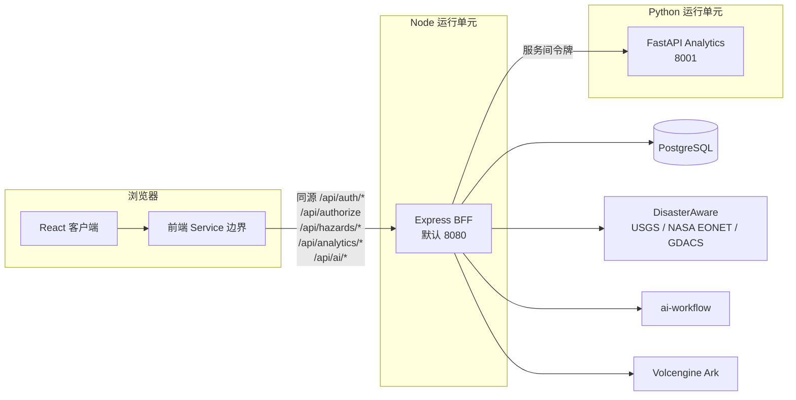
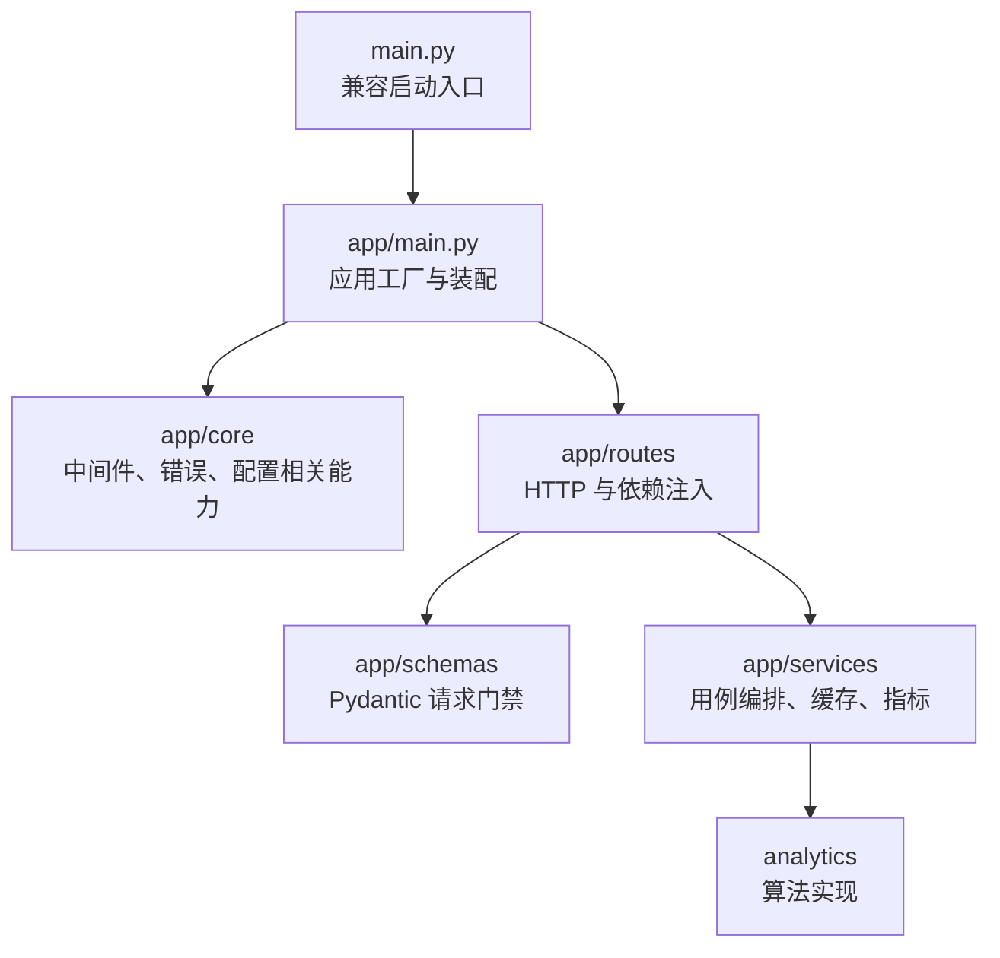
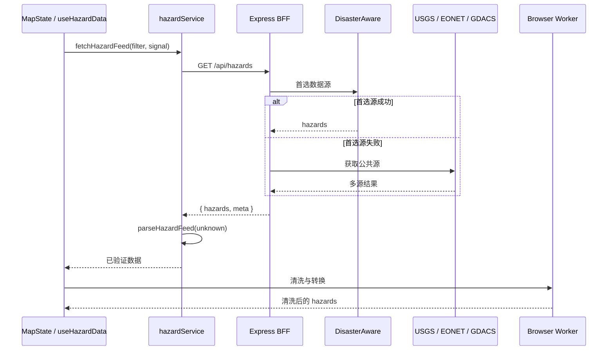

# Prometheus Global Guardian 项目规格书

## 1. 文档定位

本文档描述 Prometheus Global Guardian 当前代码、配置和持续维护规则所形成的工程规格，作为开发、维护和技术评审的入口。它记录现状和已生效边界，不替代各模块 README、测试基线、优化清单或历史设计记录。

事实发生冲突时，按以下顺序核对：

1. 当前应用代码、运行配置、构建配置和自动化测试；
2. `AGENTS.md` 中的当前协作约束；
3. `README.md`、`services/analytics/README.md`、`docs/TESTING_BASELINE.md` 和 `docs/PROJECT_OPTIMIZATION_BACKLOG.md`；
4. `docs/superpowers/specs/` 和 `docs/superpowers/plans/` 中的历史设计与计划。

历史设计和计划用于说明决策背景，不覆盖当前代码事实，也不在维护本规格书时改写。

## 2. 项目定位、当前状态与非目标

Prometheus Global Guardian 是一个用于全球灾害监测、地理空间展示、分析和 AI 辅助事件研判的本地开发项目。仓库包含 React 客户端、Express BFF、FastAPI 分析服务、PostgreSQL 账号与 AI 持久化，以及灾害数据源和 AI Provider 集成。

当前代码已实现以下能力：

- 聚合 DisasterAware、USGS、NASA EONET 和 GDACS 灾害数据并形成统一的 `Hazard` 数据；
- 在 Mapbox 地图和分析界面中消费同一灾害状态；
- 通过 FastAPI 提供统计、预测、风险、ETL、质量、统一模型和透视分析；
- 通过 Express BFF 完成 DisasterAware 服务端授权、受限代理、多源灾害聚合和 AI 流式代理；
- 通过 PostgreSQL/Prisma 提供账号注册、服务端会话、全站 API 登录门禁、账号隔离的 AI 对话/消息以及用户控制的长期记忆；Analytics 浏览器请求经 BFF allowlist 代理并使用服务间令牌访问 FastAPI；
- 通过 BFF 的 `meta.sources[]` 为 DisasterAware、USGS、NASA EONET 和 GDACS 输出固定五分钟窗口的进程内来源健康快照；
- 通过前端 Service 运行时解析、Python Pydantic 模型和共享 JSON 样本维护 Analytics 输入边界；
- 通过 `packages/hazard-domain/` 与 `packages/contracts/hazard-event.json` 维护统一事件/图层注册表，通过 `@pgg/hazard-domain` 公共入口向 BFF、浏览器 Worker、地图、Analytics、质量检查、AI 和 Python 传递 canonical 灾害字段；
- 通过 lint、格式检查、TypeScript 类型检查、多层自动化测试和构建命令执行质量检查。

当前仓库没有部署工作流，Docker Compose 只定义本地完整栈启动方式。以下能力不属于当前已实现范围：

- 面向公网部署的邮箱验证、密码找回、OAuth、角色授权、网关、共享限流和集中告警；
- AI 跨实例 SSE 恢复、成本配额和熔断；
- Analytics 4D `data` 内部字段的完整跨语言共享契约、复杂几何与历史回放；
- 灾害历史快照、PostGIS 空间索引和审计存储；账号/AI 持久化数据库不用于这些灾害历史能力；
- 完整视觉回归、真实第三方服务集成测试和自动发布。

## 3. 术语

| 术语             | 含义                                                                                                                                                                 |
| ---------------- | -------------------------------------------------------------------------------------------------------------------------------------------------------------------- |
| Browser / 浏览器 | Vite 构建的 React 客户端运行环境。`VITE_*` 值会进入浏览器构建产物，只能承载公开配置。                                                                                |
| BFF              | Express 服务。负责静态客户端、用户会话、API 登录门禁、DisasterAware 受限代理、灾害聚合、Analytics 代理和 AI Provider 路由/持久化。                                   |
| Analytics        | 独立 FastAPI 服务及其分析算法。浏览器经同源 `/api/analytics` 访问 BFF，再由 BFF 以服务间令牌代理。                                                                   |
| Hazard           | 地图、分析、AI 上下文和报告流程共同消费的灾害领域记录。                                                                                                              |
| Service 边界     | `apps/web/src/services/` 中负责 HTTP 调用、外部数据适配、运行时解析和业务错误语义的边界。                                                                            |
| Provider         | BFF 调用的 AI 上游；当前实现支持 ai-workflow 与 Volcengine Ark。                                                                                                     |
| 共享契约工件     | `packages/contracts/analytics-hazard-data.json` 与 `packages/contracts/hazard-event.json`，供 TypeScript 与 Python 测试共同读取的 Analytics 输入和统一灾害事件样本。 |
| 管理接口         | FastAPI 的 `/metrics` 与 `/cache/clear`；启用后要求静态管理令牌。                                                                                                    |

## 4. 系统上下文与拓扑

浏览器的业务 API 统一经同源 `/api/*` 进入 Express BFF。BFF 校验用户会话并执行资源授权；Analytics 请求再由 BFF 通过 allowlist 和服务间令牌转发至 FastAPI。BFF 将用户、会话、AI 对话和记忆写入 PostgreSQL。

浏览器不得接收 DisasterAware 用户名、密码或 access token，不得接收 AI Provider key，也不得接收 Python 管理令牌。上述值只能由相应服务端运行时读取。前端所需公开配置使用 `VITE_*`，并在客户端构建时写入产物。

## 5. 技术栈与运行要求

| 层级      | 当前技术与用途                                                                                                |
| --------- | ------------------------------------------------------------------------------------------------------------- |
| 前端      | React 19、TypeScript 5、Vite 7；Mapbox GL 提供地图，deck.gl/loaders.gl 提供可选 3D Tiles，Recharts 提供图表。 |
| BFF       | Express 5、Node.js；负责本地静态服务、API 边界、上游访问和 AI SSE 转换。                                      |
| Analytics | FastAPI、Pydantic、Pandas、NumPy、SciPy、Statsmodels、Scikit-learn。                                          |
| 测试      | Node test runner、Vitest、React Testing Library、jsdom、Playwright、Python unittest。                         |
| 工具链    | Node.js `>=20.19 <21`、`.nvmrc` 的 `20.19.0`、pnpm `10.15.1`、Python 3.13 依赖环境。                          |

## 6. 目录地图

| 路径                                                     | 责任                                                                        |
| -------------------------------------------------------- | --------------------------------------------------------------------------- |
| `apps/web/index.html`                                    | Vite 浏览器 HTML 入口。                                                     |
| `apps/web/src/App.tsx`                                   | 客户端组合根、Provider 装配、视图选择和组件懒加载。                         |
| `apps/web/src/features/`                                 | 当前包含 `map/` 与 `analytics/` 两个 feature 的 React UI、Hook 和局部逻辑。 |
| `apps/web/src/components/`                               | 共享展示组件，以及当前尚未迁入 feature 的 AI 助手、设置与报告弹窗。         |
| `apps/web/src/hooks/`                                    | 供组件使用的跨组件 Hook；AI 会话 Hook 当前位于此处。                        |
| `apps/web/src/config/`、`apps/web/src/utils/`            | 浏览器公开配置、日志、通知和无业务归属的纯工具。                            |
| `apps/web/src/state/`                                    | 跨功能 UI 状态；`UIStateContext` 持有活动视图和弹窗状态。                   |
| `apps/web/src/state/AuthContext.tsx`                     | 恢复服务端用户会话、CSRF token 和认证操作。                                 |
| `apps/web/src/services/`                                 | 浏览器业务请求、HTTP 调度、外部数据适配、运行时响应解析和 Service 错误。    |
| `apps/web/src/types/`                                    | 客户端共享领域类型。                                                        |
| `apps/web/src/workers/`                                  | 浏览器 Worker 数据处理。                                                    |
| `apps/bff/index.ts`                                      | Express 应用装配、授权、灾害 API、静态资源和监听入口。                      |
| `apps/bff/ai/`                                           | AI Provider 配置、路由判定、请求处理和流协议转换。                          |
| `apps/bff/auth/`                                         | 密码哈希、服务端会话、CSRF 校验和用户认证路由。                             |
| `apps/bff/db/`                                           | Prisma/PostgreSQL 客户端初始化。                                            |
| `apps/bff/analytics/`                                    | 认证后的 Analytics allowlist BFF 代理。                                     |
| `apps/bff/hazards/`                                      | 公共灾害源获取、适配、缓存和聚合。                                          |
| `apps/bff/security/`                                     | BFF 请求体、query、路由、上游请求、AI 输入和限流边界。                      |
| `packages/hazard-domain/`                                | 浏览器与 Node 共用的 canonical 灾害事件、来源/图层注册表和事件 ID 规则。    |
| `services/analytics/app/`                                | FastAPI 应用工厂、core、routes、schemas 和应用服务。                        |
| `services/analytics/analytics/`                          | ETL、统计、预测、风险、质量、统一模型和透视算法实现。                       |
| `packages/contracts/`                                    | Analytics 与统一灾害事件的跨语言契约样本。                                  |
| `packages/hazard-domain/`                                | 浏览器与 Node 共用的 canonical 灾害事件、来源/图层注册表和事件 ID 规则。    |
| `package.json`、`vite.config.ts`                         | 仓库脚本、Web 构建入口和根 `dist/` 产物配置。                               |
| `prisma.config.ts`、`prisma/`                            | Prisma CLI 根配置、数据库 schema 与版本化 migration。                       |
| `tsconfig*.json`、`eslint.config.js`                     | 跨 Web、BFF、契约和配置文件的 TypeScript/ESLint 编排边界。                  |
| `vitest.config.ts`、`playwright.config.ts`、`Dockerfile` | 仓库级测试与容器编排入口。                                                  |
| `docker-compose.yml`、`docker-compose.test.yml`          | 本地完整栈与隔离测试数据库的 Compose 编排入口。                             |
| `tooling/docker/check-compose.sh`                        | 无需启动容器即可校验两套 Compose 配置的结构与覆盖关系。                     |
| `tests/`                                                 | BFF、前端 Service、组件、契约和 E2E 自动化测试。                            |
| `services/analytics/tests/`                              | Python 模型、路由、服务与算法自动化测试及手工脚本。                         |
| `.github/workflows/`                                     | 当前 GitHub Actions 质量工作流。                                            |
| `docs/`                                                  | 当前测试基线、优化清单、本规格书和历史过程记录。                            |

根目录配置文件按“仓库编排入口”治理，不按业务功能拆散：`prisma.config.ts` 跟随 Prisma CLI 的默认发现规则，`playwright.config.ts` 负责跨 Web/BFF 的生产构建冒烟，`vite.config.ts`、`vitest*.config.ts` 和 `tsconfig*.json` 负责多运行单元的构建、测试和类型边界；`eslint.config.js`、`commitlint.config.cjs`、`cspell.json` 和 `.prettierrc.json` 是仓库级质量策略。依赖管理只保留 pnpm 的 `pnpm-workspace.yaml` 与 `pnpm-lock.yaml`，不保留平行 `package-lock.json`。

## 7. 运行单元与职责边界

### 7.1 React 客户端

`AuthProvider` 在挂载受保护界面前恢复 `/api/auth/session`。未登录时显示登录/注册界面；登录后装配 `UIStateProvider` 与 `MapStateProvider`、选择地图或分析视图，以及懒加载分析、报告、设置和 AI 功能。跨功能状态按领域归属：

- `UIStateProvider` 持有 `activeView` 和 `activeModal`，公开视图和弹窗动作；
- `MapStateProvider` 持有 hazards、类型筛选、地图样式、来源元数据和刷新动作；
- `useHazardData` 负责刷新、页面可见性暂停、同筛选请求去重、取消、请求序号防竞态和 Worker 清洗；
- 地图实例与图层属于地图 feature，AI 会话属于 AI Hook，Analytics 请求状态属于 Analytics feature。

React 组件消费经过 Service 或 feature adapter 转换的领域数据。组件不得将外部 JSON 直接断言为内部类型，也不得跨接口把一种 Analytics 结果强制解释成另一种结果。

### 7.2 浏览器 Service 层

`apps/web/src/services/http/httpClient.ts` 提供通用超时、取消、有限重试和 `ServiceError` 归一化。业务 Service 负责端点、请求体、运行时契约解析和业务错误语义。

网络 JSON 在边界处先作为 `unknown` 读取。Hazard 与 Analytics Service 必须通过对应 parser 验证成功后，才能把数据交给状态、Hook 或组件。网络错误、超时、HTTP 错误、无效 JSON 和无效响应会归一化为 `ServiceError`；调用方主动取消原样传播且不重试。默认 HTTP 超时为 30 秒，重试次数由调用方指定，网络错误、超时、429 和 5xx 才属于可重试范围。

### 7.3 Express BFF

BFF 的公开应用职责包括：

| 路径                               | 方法   | 责任                                                                                      |
| ---------------------------------- | ------ | ----------------------------------------------------------------------------------------- |
| `/api/authorize`                   | `POST` | 使用服务端 DisasterAware 凭据获取上游 token，仅向浏览器返回授权状态。                     |
| `/api/auth/register`、`/login`     | `POST` | 注册和登录；仅这些认证入口不要求已有用户会话。                                            |
| `/api/auth/session`                | `GET`  | 校验 HttpOnly Cookie 并恢复当前用户会话。                                                 |
| `/api/auth/logout`、`/account`     | 多种   | 撤销会话、修改账号偏好或验证密码后删除账号。                                              |
| `/api/hazards`                     | `GET`  | 优先使用 DisasterAware，失败时聚合 USGS、NASA EONET 和 GDACS；返回 hazards 与来源元数据。 |
| `/api/hazards/types`               | `GET`  | 代理允许的 DisasterAware 类型端点。                                                       |
| `/api/hazards/active`              | `GET`  | 代理允许的活动灾害端点。                                                                  |
| `/api/hazards/active/category/:id` | `GET`  | 代理允许的灾害类别端点。                                                                  |
| `/api/analytics/*`                 | 多种   | 限定路径与方法，将业务请求代理到私有 FastAPI。                                            |
| `/api/ai/conversations*`           | 多种   | 用户隔离的会话和消息读取、创建、删除与流式生成。                                          |
| `/api/ai/cancel`                   | `POST` | 取消当前用户正在进行的 AI 生成，并将助手消息标记为失败/取消终态。                         |
| `/api/ai/memories*`                | 多种   | 用户记忆与待确认记忆建议管理。                                                            |

其他 `/api/*` 路径或不允许的方法返回稳定的 404 或 405，不构成任意上游代理。

BFF 执行以下请求边界：

- 关闭 `X-Powered-By`，`trust proxy` 为 `false`；
- 非 GET/HEAD 请求有 64 KiB 原始 JSON body 上限，并要求 `application/json`；
- query 最多 20 项，键和值最长 256 字符，不接受嵌套方括号和值数组；
- DisasterAware 转发只保留 `accept` 与 `accept-language`，`Authorization` 由服务端 token 生成；
- DisasterAware 和公共灾害源请求通过受限 helper 执行超时、禁止重定向和 8 MiB 响应体限制；
- 授权、AI、hazard 接口分别使用单进程内存固定窗口限流；
- 注册和登录使用独立单进程固定窗口限流；密钥由 `AUTH_CSRF_SECRET` 提供，生产模式拒绝空值、短密钥和仓库示例占位值；
- 日志上下文只保留字符串、数字、布尔值，并按敏感字段名过滤值。

`/api/hazards` 在既有 `meta.sources[]` 的来源状态旁可返回健康快照。快照固定聚合当前 BFF 进程最近五分钟的真实 `load()` 尝试，包含尝试/成功/失败数、成功率、平均和最近延迟、最近尝试与成功时间、连续失败数及稳定错误码。一次 `load()` 最多记录一次，现有一次重试最多形成两条记录；DisasterAware 认证不单独计数。空数组是成功，缓存命中、`stale` 和 fallback 占位状态只读取快照而不新增尝试。错误码仅为 `TIMEOUT`、`HTTP_ERROR`、`INVALID_RESPONSE` 或 `UPSTREAM_ERROR`，不暴露上游异常细节。该统计不持久化，BFF 重启后窗口为空。

除注册、登录和会话恢复外，`/api/*` 均通过数据库会话门禁；状态变更要求同源 Origin 和会话绑定的 CSRF token。系统没有角色体系、邮箱验证、密码找回或 OAuth；`/api/authorize` 仍只代表 BFF 检查 DisasterAware 上游连接。

AI Provider 请求具有独立边界：请求有超时、响应开始前的 Provider 降级和流中断处理，但当前不复用公共灾害源的统一重定向禁止与 8 MiB 响应体上限。新增 AI Provider 时需要单独评估这两项边界。

### 7.4 FastAPI Analytics 服务

Python 服务按以下层次组织：

- `app/main.py:create_app()` 配置日志、应用状态、CORS、request-id middleware、BFF 服务令牌校验依赖，并注册 health、analytics、quality 和 pivot router；
- `app/routes/` 接收 Pydantic 请求并注入应用服务，不直接持有算法对象；
- `app/schemas/requests.py` 定义请求门禁；主要请求模型拒绝未声明字段；
- `app/services/` 负责编排、缓存、指标和模型到 DataFrame 的转换；
- `analytics/` 负责 ETL、统计、预测、风险、质量、统一模型和透视算法。

每个请求会设置并回传 `X-Request-Id`。所有 `/api/v1` 业务接口通过统一 helper 返回版本化成功信封和稳定错误信封；成功响应包含 `schemaVersion`、`requestId`、`generatedAt`、`modelVersion`、`inputSnapshotId`、`warnings`，错误响应使用 `ANALYTICS_VALIDATION_ERROR` 或 `ANALYTICS_INTERNAL_ERROR`。日志过滤异常文本和敏感字段。

`/health` 公开。所有 `/api/v1/*` 业务路由要求 `X-Analytics-Service-Token`，该值只由 BFF 转发且以常量时间比较；未配置或不匹配时返回 404。`/metrics` 和 `/cache/clear` 依赖独立的 `ANALYTICS_ADMIN_TOKEN` 与 `X-Analytics-Admin-Token`；该令牌只保护两个管理接口。

FastAPI CORS 默认使用显式 localhost 来源列表，可由逗号分隔的 `ANALYTICS_CORS_ORIGINS` 覆盖；允许 GET、POST、OPTIONS，允许 `Content-Type`、管理/服务令牌和 `X-Request-Id` header，并暴露 `X-Request-Id`，不允许 Cookie 凭据。生产浏览器不直连该服务。

### 7.5 分层与依赖规则

分层用于约束依赖方向，而不是为每个目录引入额外抽象。新增代码应落在最接近其责任的层，且只能依赖表中左侧允许的下游能力。

| 层                            | 可以依赖                                                                          | 不得承担或依赖                                                        |
| ----------------------------- | --------------------------------------------------------------------------------- | --------------------------------------------------------------------- |
| React 页面与组件              | feature Hook、状态 Provider、Service 暴露的领域结果、纯展示工具                   | `fetch`、外部 JSON 结构、服务端凭据、BFF/Python 内部实现              |
| Feature Hook 与状态域         | Service、领域类型、Worker、通知等 UI 基础设施                                     | 直接拼接外部 API 协议、跨 feature 写入彼此的领域状态                  |
| `apps/web/src/services/`      | HTTP client、运行时 parser、领域类型、端点配置                                    | React 组件、Mapbox 实例、全局 UI 状态；未验证的 JSON 不得越过 Service |
| `apps/web/src/services/http/` | `fetch`、超时/取消、错误归一化与基础响应处理                                      | 业务端点、Analytics 或 Hazard 的领域解释                              |
| Express 路由与 handler        | 安全边界、AI/Hazard 领域模块、服务端配置与日志                                    | 浏览器 `VITE_*` 秘密、任意 URL 透传、将上游原始错误暴露给浏览器       |
| BFF 领域模块                  | 明确的上游 adapter、服务端安全策略、共享日志                                      | React、浏览器状态、未受限的路径或方法转发                             |
| FastAPI route                 | Pydantic schema、依赖注入的应用服务                                               | 直接编排底层算法对象、绕过请求模型读取未验证 body                     |
| Python 应用服务               | schema、应用状态、缓存、`analytics/` 算法模块                                     | HTTP 框架对象和浏览器语义                                             |
| `analytics/` 算法             | Python 标准库与数据科学依赖                                                       | FastAPI request/response、环境变量读取、路由鉴权逻辑                  |
| `packages/contracts/`         | 语言无关的 JSON 工件                                                              | 某一端的编译产物或运行时实现代码                                      |
| `packages/hazard-domain/`     | 纯 TypeScript 灾害领域类型、事件 ID 和图层注册表；公共入口为 `@pgg/hazard-domain` | React、Express、HTTP、环境变量、数据库和运行单元内部实现              |

以下规则在新增功能时必须保持：

- 浏览器调用业务能力先经过 Service；不得在组件、Context 或 Worker 中新增裸 `fetch`；
- 新增外部输入应在浏览器和 BFF/Python 入口保持 `unknown` 或未验证状态，完成 parser 或 Pydantic 校验后才转换为领域类型；当前公共灾害源 adapter 仍有直接把 `response.json()` 断言为接口的历史例外；
- React 状态按领域归属。地图数据、筛选、样式和来源元数据只由地图状态域写入；页面与弹窗只由 UI 状态域写入；组件临时交互状态保留在组件或对应 Hook；
- BFF 当前对路径、方法和转发 header 使用 allowlist，query 仅限制形状、数量和长度并会原样转发；AI 请求会校验已知字段但尚不拒绝所有未知字段。新增上游能力必须明确输入限制、超时、响应上限、错误契约与测试；
- Python 新接口按 `schema -> route -> service -> analytics` 方向接入。算法函数不能因 HTTP 需求改变为读取 request、环境变量或全局应用对象；
- 共享输入变化先更新 `packages/contracts/` 工件与双端测试，再调整 TypeScript Service 和 Python schema；不得只修改一端以维持表面兼容；
- `packages/*` 不能用相对路径反向导入 `apps/web/src/`、`apps/bff/`、`apps/` 或 `services/`；`apps/web/src/`、`apps/bff/` 的生产代码不能直接导入 `packages/hazard-domain/src/` 内部模块。Web 和 BFF 应通过 `@pgg/hazard-domain` 公共入口使用该包；
- 同一业务语义在不同层可有不同数据表示，但转换只能在边界 adapter、parser 或 schema 中发生，不能散落在 UI 和路由条件分支中。

### 7.6 类型、错误和日志细则

- TypeScript 新增边界输入使用 `unknown`，通过类型守卫、parser 或判别联合收窄；避免新增无必要的 `any`，类型导入使用 `import type`；
- 新增或修改的对外错误应使用稳定 code、可安全展示的 message 和 request id。Analytics `/api/v1` 路由统一返回版本化错误信封；前端解析器只保留服务错误码和请求 ID，不传播上游响应正文；
- 取消属于控制流：调用方主动取消不应被包装成可重试的业务失败，也不应产生面向用户的错误通知；
- 日志事件记录可脱敏的状态、耗时、数量、provider、HTTP status 和 request id。不得记录密钥、token、Cookie、鉴权 header、完整请求/响应 body、原始异常文本或堆栈；
- 新环境变量必须标明归属运行单元、是否公开、默认值、缺失行为和 Docker/CI 传递方式。任何秘密变量不得使用 `VITE_` 前缀；
- 公开接口的失败语义、默认值、字段校验、单位和坐标顺序属于契约的一部分。修改它们需要同步更新测试与当前说明文档。

## 8. 核心数据流

### 8.1 灾害数据

`meta` 记录首选源、是否使用 fallback、各来源状态和 stale 状态。每个来源还可携带最近五分钟的进程内健康快照：真实 `load()` 成功（包括空数组）或失败才计数，缓存、`stale` 和 fallback 占位不改变来源统计。Worker 只返回清洗后的 hazards；`useHazardData` 在主线程分别写入 Worker 结果和原始 `response.meta`。客户端用取消、请求去重和序号防护避免筛选或刷新变化时写入迟到响应。

BFF 的 DisasterAware、USGS、NASA EONET 和 GDACS adapter 均在服务端边界生成 canonical `eventId`、`sourceEventId`、`sourceId`、`layerId`、观测/更新时间和置信度字段；浏览器 parser、Worker 和地图转换保留同一事件标识。未知来源或图层安全回退为 `unknown`，旧 `id`、`source` 和 `timestamp` 字段仍在迁移期兼容解析。

### 8.2 Analytics

前端先用 `formatHazards` 统一 Hazard 字段，再通过 `parseAnalyticsHazardData` 检查待发送数据。浏览器通过 `/api/analytics` 向 BFF 发送请求；BFF allowlist 校验后向 FastAPI `/api/v1/*` 转发并附加服务间令牌。响应先读为 `unknown`，再由端点对应 parser 构造成类型化成功结果。

共同输入保留旧版 `id`、`timestamp` 和 `source` 兼容字段，并优先使用 `eventId`、`sourceEventId`、`sourceId`、`layerId`、`observedAt`、`updatedAt` 和 `confidence` 等 canonical 字段；`type`、`title`、`coordinates`、`magnitude`、`severity` 和可选 `populationExposed` 继续受原有边界约束。坐标顺序为 `[longitude, latitude]`，置信度必须在 `[0, 1]`。Python Pydantic 是服务端最终请求门禁。成功响应和错误响应分别使用 `packages/contracts/analytics-response-envelope.json`、`packages/contracts/analytics-error-envelope.json`，事件输入使用 `packages/contracts/hazard-event.json` 作为双端共享样本；输入摘要只返回 SHA-256，不保存原始请求。

### 8.3 AI 流式会话

浏览器向 `POST /api/ai/conversations/:conversationId/messages` 发送单条新消息和灾害上下文。BFF 按当前 `userId` 读取会话与历史消息，执行上下文预算、摘要和已确认长期记忆注入，然后选择 Provider；助手流和最终结果均写入 PostgreSQL。路由模式根据知识库、灾害领域和实时上下文信号选择优先 Provider；强制模式固定使用 workflow 或 Ark。首选 Provider 在响应开始前失败时，BFF 才尝试另一个 Provider。

前端只在 React state 中维护当前呈现状态；用户拥有的对话和消息保存在 PostgreSQL，刷新后可重新加载，用户之间通过所有权查询隔离。同一 UI 会话只允许一个活动请求，关闭、清空、停止或卸载会取消流；Hook 的本地请求序号防止迟到 chunk 写入新请求，Service 为每次 SSE 逻辑请求生成随机请求 ID 并在自动重连中复用。手动重试使用同一客户端消息 ID，不重复追加用户消息。服务端模型上下文限制为 48 KiB，保留当前输入和近期完整轮次，并为被裁剪的较早轮次更新摘要；原始消息仍保存。单条用户输入上限为 8,000 字符。

客户端 SSE parser 支持 CRLF、注释心跳、多行 `data` 和任意 UTF-8 字节分割，以 `[DONE]` 作为完成标记。网络异常、读取异常或没有 `[DONE]` 的 EOF 会在有限次数内使用相同请求 ID 和 `Last-Event-ID` 自动恢复，并按事件 ID 去重；显式 provider 错误和 HTTP 错误不自动重试。BFF 在单实例短时有界内存会话中缓存已转换事件，恢复窗口结束后返回稳定过期错误。Provider 配置缺失的特定 503 错误触发浏览器本地 Demo 流；provider-backed 回复按流检查点和终态写入数据库，其他上游正文不会直接展示给用户。长期记忆仅在用户显式生成并逐条接受后进入上下文。

## 9. 跨语言契约与测试责任

`packages/contracts/analytics-hazard-data.json` 与 `packages/contracts/hazard-event.json` 是 TypeScript 与 Python 共同读取的 Analytics 灾害输入和统一事件样本。双方不互相导入实现代码：

- TypeScript 侧由 `formatHazards`、运行时 parser 和 `tests/integration/service-cross-language-hazard-contract.test.ts` 验证；
- Python 侧由 Pydantic `HazardData`、请求模型和 `services/analytics/tests/test_cross_language_hazard_contract.py` 验证；
- 修改共同输入字段、默认值、长度、坐标、数值或未知字段策略时，必须同步更新共享样本和双端测试；
- Analytics 响应由 Python 统一 helper 生成版本化成功/错误信封，前端 parser 对元数据成组校验并保留迁移期旧响应兼容；双方共同读取 `packages/contracts/analytics-response-envelope.json`、`packages/contracts/analytics-error-envelope.json` 和 `packages/contracts/hazard-event.json`。`data` 内部业务字段和 4D 扩展仍由各领域 parser 维护，不能据此推断复杂几何或历史回放已经完成。

## 10. 配置与秘密边界

| 范围           | 变量或配置                                                                                                                                                          | 边界                                                                                                                                                                   |
| -------------- | ------------------------------------------------------------------------------------------------------------------------------------------------------------------- | ---------------------------------------------------------------------------------------------------------------------------------------------------------------------- |
| 浏览器构建     | `VITE_MAPBOX_TOKEN`、`VITE_3D_TILES_URL`、`VITE_CESIUM_ION_TOKEN`、`VITE_LOG_LEVEL`                                                                                 | 会进入客户端产物，只能放公开配置。                                                                                                                                     |
| Express 运行时 | `DATABASE_URL`、`AUTH_CSRF_SECRET`、`PUBLIC_ORIGIN`、Analytics 服务 URL/令牌、DisasterAware 凭据、`AI_PROVIDER`、AI Provider 凭据、`BFF_AI_STREAM_RESUME_*`、`PORT` | 只在服务端读取；不得改用 `VITE_` 前缀。生产环境要求有效非占位 CSRF 密钥。`PUBLIC_ORIGIN` 用于 TLS 终止反向代理下的精确来源校验和 Secure Cookie；`PORT` 缺失时为 8080。 |
| BFF 上游与限流 | `DISASTERAWARE_REQUEST_TIMEOUT_MS`、`HAZARD_SOURCE_TIMEOUT_MS`、`BFF_AUTHORIZE_RATE_LIMIT_MAX`、`BFF_AI_RATE_LIMIT_MAX`、`BFF_HAZARD_RATE_LIMIT_MAX`                | 缺失时依次使用 10,000 ms、8,000 ms、10、30、120；代码会限制其最大值。当前 Compose 未显式传递这些值。                                                                   |
| FastAPI 运行时 | `ANALYTICS_ADMIN_TOKEN`、`ANALYTICS_CORS_ORIGINS`、`APP_ENV`、`LOG_LEVEL`                                                                                           | 管理令牌只在服务端使用；CORS 来源由部署配置确定。                                                                                                                      |

日志不得记录凭据、token、Cookie、完整 header、请求/响应 body、原始异常消息或堆栈。`ServiceError` 可保留 `responseBody` 和 `cause` 供调用层判断；新增调用方不得直接渲染或记录这些字段。现有 Analytics 4xx 展示路径是第 7.6 节记录的待收口例外。

## 11. 构建、启动与容器边界

### 11.1 本地命令

| 命令                                    | 当前作用                                                                                              |
| --------------------------------------- | ----------------------------------------------------------------------------------------------------- |
| `pnpm dev`                              | 通过项目 Node 版本包装脚本启动 Vite。Vite 配置将 `/api/ai` 和 `/api` 转发到 `http://localhost:8080`。 |
| `pnpm run db:generate`                  | 从 Prisma schema 生成服务端 Prisma Client。                                                           |
| `pnpm run db:migrate:deploy`            | 显式应用 PostgreSQL 版本化迁移；服务启动不会自动迁移。                                                |
| `pnpm run build:server`                 | 生成 Prisma Client 并编译 Express BFF。                                                               |
| `pnpm start`                            | 运行 `dist-server/apps/bff/index.js`；BFF 默认监听 8080，并托管 `dist` 与 SPA 回退。                  |
| `./services/analytics/start-service.sh` | 启动本地 Python Analytics 服务。                                                                      |
| `pnpm build`                            | 顺序执行 Vite 客户端构建和 BFF TypeScript 编译。                                                      |
| `docker compose up --build`             | 构建并启动本地完整栈。                                                                                |

`vite.config.ts` 没有显式固定浏览器开发服务器端口，因此具体开发端口不作为本规格的配置契约。

### 11.2 Docker

根 Dockerfile 使用 Node 20.19 的两阶段构建。构建阶段安装锁定依赖并生成 `dist` 与 `dist-server`；运行阶段只安装生产依赖并以 `node dist-server/apps/bff/index.js` 启动 8080。

Python Dockerfile 基于 Python 3.13 slim，安装 requirements 并以 Uvicorn 在容器内 `0.0.0.0:8001` 启动。容器文件的归属边界固定为：根 `Dockerfile` 负责 Web/BFF 完整栈镜像，`services/analytics/Dockerfile` 只负责 Analytics 镜像；根 `docker-compose.yml` 是本地完整栈入口，`docker-compose.test.yml` 只覆盖隔离测试数据库；`tooling/docker/check-compose.sh` 负责无运行时副作用的配置校验。它们保留在根目录或服务目录是为了保持标准 Compose 命令和运行单元归属，不再新增平行的 `docker/` 副本。

Compose 中：

- `web` 发布 `8080:8080`，并等待 PostgreSQL 和 Analytics healthcheck 成功；
- `db` 使用具名卷保存用户和 AI 持久化数据，默认发布 `5432:5432` 供 DataGrip 等本地工具连接；测试覆盖会改用 `127.0.0.1:55439` 和独立卷；
- `analytics` 不发布主机端口，只在私有 Compose 网络中接受 BFF 服务令牌；
- 迁移使用 `docker compose exec web pnpm run db:migrate:deploy` 显式执行，不会自动在生产启动时执行；
- Compose 没有定义镜像发布或部署过程，示例口令仅供本地使用。

## 12. 质量基线与测试分层

| 命令                               | 责任                                                                                               |
| ---------------------------------- | -------------------------------------------------------------------------------------------------- |
| `pnpm run lint`                    | TypeScript、React、BFF 和配置 ESLint 检查。                                                        |
| `pnpm run format:check`            | 检查脚本清单中列出的 Markdown、JSON、TypeScript、测试和配置。                                      |
| `pnpm run typecheck:client`        | 客户端 TypeScript 类型检查。                                                                       |
| `pnpm run typecheck:server`        | Express BFF TypeScript 类型检查。                                                                  |
| `pnpm run typecheck:contracts`     | TypeScript 契约正反例类型检查。                                                                    |
| `pnpm run check:architecture`      | 检查共享包元数据、契约唯一目录和共享包与运行单元的导入方向。                                       |
| `pnpm run check:docker`            | 校验根 Compose 与测试覆盖 Compose 的配置结构，不启动服务或访问数据卷。                             |
| `pnpm test` / `pnpm run test:unit` | 串行执行 BFF Node 测试和前端 Service Vitest。                                                      |
| `pnpm run test:component`          | React Testing Library + jsdom 组件测试。                                                           |
| `pnpm run test:e2e`                | Playwright 本地生产构建关键流程冒烟。                                                              |
| `pnpm run test:python`             | Python unittest。                                                                                  |
| `pnpm run test:baseline`           | lint、格式、三项类型检查、架构检查、Docker 配置检查、unit、component、E2E 和构建的完整 Node 基线。 |
| `pnpm run build`                   | 客户端生产构建与 BFF 编译。                                                                        |

`test:baseline` 不包含 Python 测试。CI 的 `frontend-bff` job 安装锁定 pnpm 依赖后显式运行 `check:architecture`，安装 Chromium 后运行 `test:baseline`；独立 `python` job 使用 Python 3.13 安装 requirements 后运行 `test:python`。Quality Gate 在 pull request 和对 `main` 的 push 上触发，权限为只读仓库内容。当前工作流没有 Docker build、镜像发布或部署步骤，但 Node 基线会运行 `check:docker` 校验两套 Compose 配置。Web 位于 `apps/web/`，Vite 从 `apps/web/index.html` 构建，客户端产物仍位于根 `dist/` 并由 Express 提供。BFF 位于 `apps/bff/`，入口为 `apps/bff/index.ts`，编译入口为 `dist-server/apps/bff/index.js`。Analytics 位于 `services/analytics/`，入口为 `main.py`，由独立 FastAPI 进程提供服务。

测试责任按边界分配：

- Service 测试覆盖请求、parser、适配器、错误和 AI 流协议；
- BFF 测试覆盖 Provider、AI 路由、流转换、代理与安全边界；
- 组件测试覆盖用户可观察行为与 feature 状态；
- E2E 使用路由 mock 隔离第三方服务，验证本地生产构建关键路径；
- Python unittest 覆盖应用工厂、Pydantic 契约、路由、服务和算法语义；
- 跨语言输入变更由共享样本的 TypeScript 与 Python 双端测试共同保护。

受限沙箱可能禁止 BFF 测试绑定 `0.0.0.0`，表现为 `listen EPERM`；这属于环境限制，完整 BFF 验证应在正常网络命名空间或 CI 执行。E2E、Python 3.13 和浏览器依赖也以实际运行环境是否具备为准。历史验证数量和具体环境结果维护在 `docs/TESTING_BASELINE.md`，不作为本规格的固定常量。

## 13. 开发与协作规则

当前仓库开发遵循 `AGENTS.md`：

1. 修改前运行 `git status --short`，保留与当前需求无关的已有改动；
2. 新需求先采用适用的 Superpowers 流程拆解、规划和验证，计划与进度使用中文；
3. 新功能与缺陷修复默认执行 TDD：先写并运行失败测试，再以最小实现通过，随后在测试保护下重构；纯文档、格式或配置调整可不新增测试，但仍运行适用验证；
4. 新需求默认在 Git worktree 隔离开发；用户明确要求时可覆盖该默认规则；
5. 两个及以上独立任务优先由子智能体执行和复核；子智能体工作采用独立实现、任务级复核和最终整体复核；
6. 只修改需求涉及的文件，不做无关重构，不覆盖用户已有改动；手动编辑使用 `apply_patch`；
7. 完成前运行与改动范围相符的 lint、格式、测试、类型检查、构建和 `git diff --check`，并记录真实输出；
8. 不自动执行 `git add`、提交、push、创建 PR 或改写 Git 历史；只有用户明确要求提交时，先用 commitlint 校验 Conventional Commit 信息，再通过 `pnpm commit` 提交。

### 13.1 变更级质量门禁

验证范围由改动类型决定，不能以格式化代替行为验证：

| 改动类型                                     | 最低验证                                          | 额外要求                                                   |
| -------------------------------------------- | ------------------------------------------------- | ---------------------------------------------------------- |
| 纯 Markdown、格式或当前说明文档              | `pnpm run format:check`、`git diff --check`       | 核对命令、路径、数量和配置事实；不把历史计划改写为当前事实 |
| 前端 Service、parser、领域类型或公开请求行为 | 定向 Service 测试、客户端类型检查、格式和差异检查 | 公开行为变化更新契约测试；外部数据增加 parser 负例         |
| React 组件、Hook、状态 Provider 或可见交互   | 定向组件测试、相关 Service 测试、客户端类型检查   | 断言用户可观察结果和状态归属，避免测试内部实现细节         |
| Express BFF、代理、安全边界或 AI 流          | BFF Node 测试、服务端类型检查、相关 Service 测试  | 覆盖拒绝路径、超时/取消、脱敏错误及允许/拒绝的输入边界     |
| FastAPI schema、route、service 或算法语义    | Python unittest、相关跨语言契约测试               | 保持路由错误语义、Pydantic 校验和分析结果语义一致          |
| 构建、运行、Docker、CI 或依赖                | 相关构建、质量命令和配置检查                      | 说明环境前提与缓存/端口/运行时版本影响                     |

完整交付前按改动范围组合执行 `pnpm run lint`、`pnpm run format:check`、`pnpm test`、`pnpm run typecheck:client`、`pnpm run typecheck:server`、`pnpm run typecheck:contracts`、`pnpm run test:component`、`pnpm run test:python`、`pnpm run build` 与 `git diff --check`。若命令受沙箱、Node/Python 版本或浏览器依赖限制无法完成，必须记录实际命令、输出、根因和在 CI/正常本机环境中的替代验证；不得把环境限制描述为代码通过。

### 13.2 规格、说明文档与历史记录

- `docs/PROJECT_SPEC.md` 描述稳定的当前工程结构、边界和规则；
- `README.md` 和 `services/analytics/README.md` 面向使用者，描述启动、配置、接口和日常命令；
- `docs/TESTING_BASELINE.md` 记录可执行测试入口、最近验证口径和环境限制；
- `docs/PROJECT_OPTIMIZATION_BACKLOG.md` 记录当前优先级、遗留风险和演进判断；
- `docs/superpowers/specs/`、`docs/superpowers/plans/` 与 `.superpowers/` 是历史需求、设计、计划和复核记录，只在新增相应工作时增加，不回写为当前实现；
- 代码、配置与自动化测试优先于说明文档。发现不一致时，先确认实现意图，再修正当前说明文档或实现，不以文档掩盖行为差异。

### 13.3 命名、兼容性与范围控制

- 沿用现有目录、命名、模块边界和 API 兼容约定。一次需求只改动与其目标直接相关的文件；
- 公开端点、环境变量、Service 导出、领域字段和 JSON fixture 的破坏性调整需要显式迁移策略、兼容说明和测试；
- 不为未来假设引入空包、空服务、全局状态库、通用抽象层或部署基础设施；
- 新依赖必须服务于明确的当前需求，并评估它进入浏览器包、BFF 运行时或 Python requirements 的影响；
- 提交只包含已确认的本次需求文件，不包含 `node_modules`、缓存、临时报告、构建产物或未确认的生成文件。

## 14. 已知限制与遗留风险

### 14.1 安全与运行

- BFF 限流是按进程和直连 IP 计数的内存状态，没有跨实例一致性或持久化；`trust proxy=false`，代理部署需要单独设计可信代理边界；
- 当前账号方案不含邮箱验证、密码找回、OAuth、角色和公网注册滥用防护；登录/注册限流为单进程内存计数；
- Python 业务 API 不验证终端用户身份，但只接受 BFF 服务间令牌；管理令牌仍独立覆盖两个管理路由；
- Python CORS 环境变量接受非空来源字符串，生产来源的正确性由部署配置负责；
- token 与灾害源缓存都在进程内；DisasterAware token 没有持久化、显式过期解析或撤销机制。

### 14.2 AI 与会话

- 用户账号、登录会话、对话、消息、摘要和确认后的记忆保存在 PostgreSQL，并通过所有者 ID 查询；SSE 续传事件缓存仍是单实例短时内存状态，不支持跨实例恢复或审计存储；
- Provider 降级只发生在单次请求响应开始前，没有健康探测、熔断、持久化失败计数或用户/模型配额；
- 已建立的上游 SSE 若中途失败，BFF 发布安全 `event: error` 并结束会话；客户端不会把明确 provider 错误自动重试，传输异常则按有限次数自动恢复。

### 14.3 数据与产品

- Analytics 请求侧 HazardData、顶层响应信封和灾害事件/图层注册表已有共享输入/输出样本；4D `data` 内部字段的完整跨语言模型仍未统一；
- 数据源健康快照只保存在当前 BFF 进程的固定五分钟窗口，重启即清空；尚无跨实例聚合、历史趋势、持久化指标或告警。PostGIS 历史快照、复杂几何和审计存储仍需先完成技术设计并确认需求；
- PostgreSQL 当前保存账号和 AI 数据，不保存灾害历史；复杂几何、灾害历史快照、回放和审计仍需独立设计；
- 多来源 severity 与 magnitude 不天然可比较，统一强度排序需要先定义业务换算规则；
- 预测置信度、风险阈值、估算 magnitude 和质量规则仍需要真实业务样本校准；
- 当前报告下载格式与界面文案的闭环仍在优化清单中；
- Mapbox 生产 chunk 仍是包体积治理对象；视觉回归、可访问性和完整多语言资源尚未进入当前质量基线。

## 15. 后续演进原则

- 新增接口前先定义输入、输出、失败语义和测试，再接入页面或路由；
- 外部 JSON、浏览器事件和网络响应保持 `unknown` 边界，解析成功后再进入领域类型；
- 调整 Analytics 共同输入时同步修改共享 JSON 样本和 TypeScript/Python 双端测试；
- 统一灾害事件字段以 `packages/hazard-domain/` 和 `packages/contracts/hazard-event.json` 为边界；旧共享兼容目录已删除；未知来源或图层回退为 `unknown`，旧字段兼容不得扩大到未经校验的原始文本；
- 服务端凭据只由 BFF 或 Python 运行时读取，不得进入 `VITE_*` 或前端构建产物；
- 新增 BFF 上游能力时继续采用显式路径、方法、query、body、header、超时和响应大小边界；
- 不部署阶段优先保持测试可复现和提交边界清晰；身份、共享限流、集中观测和告警在决定公网部署时单独设计；
- 优化优先级与最近验证状态维护在 `docs/PROJECT_OPTIMIZATION_BACKLOG.md` 和 `docs/TESTING_BASELINE.md`，本规格书只维护稳定的工程边界。

## 16. 事实来源

本规格的当前事实来自以下可复核位置：

- 运行与构建：`package.json`、`.nvmrc`、`vite.config.ts`、`Dockerfile`、`docker-compose.yml`、`docker-compose.test.yml`、`tooling/docker/check-compose.sh`、`.github/workflows/quality.yml`；
- React 与 Service：`apps/web/src/App.tsx`、`apps/web/src/state/`、`apps/web/src/features/`、`apps/web/src/services/`、`apps/web/src/hooks/useAIChatSession.ts`；
- Express BFF：`apps/bff/index.ts`、`apps/bff/ai/`、`apps/bff/hazards/`、`apps/bff/security/`、`packages/logging/`；
- Python：`services/analytics/app/`、`services/analytics/analytics/`、`services/analytics/security.py`、`services/analytics/log_config.py`；
- 契约与测试：`packages/hazard-domain/`、`packages/logging/`、`packages/contracts/analytics-hazard-data.json`、`packages/contracts/hazard-event.json`、`apps/web/tests/`、`apps/bff/tests/`、`tests/integration/`、`infra/persistence/tests/`、`services/analytics/tests/`；
- 持续维护文档：`README.md`、`services/analytics/README.md`、`docs/TESTING_BASELINE.md`、`docs/PROJECT_OPTIMIZATION_BACKLOG.md`、`AGENTS.md`。
