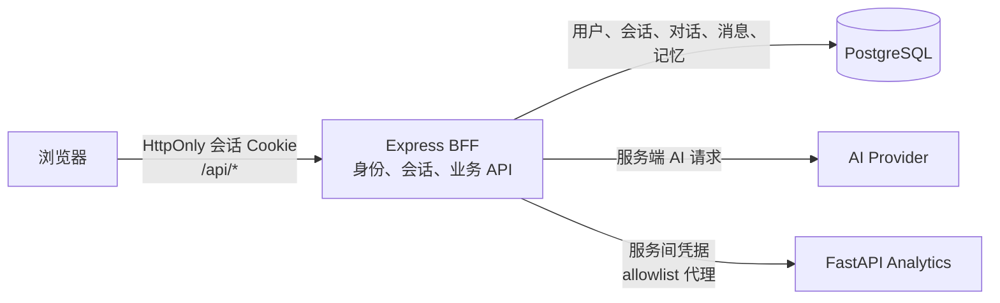

# 用户账号、全站登录与 AI 数据持久化设计

状态：已通过
日期：2026-09-21

## 目标

为 Prometheus Global Guardian 建立用户账号和全站登录，使每位用户可以跨页面、浏览器刷新和重新登录恢复 AI 对话，并以可查看、可编辑、可删除、可停用的方式管理长期记忆。

采用当前已确认的系统边界：Express BFF 是浏览器唯一业务 API 入口；PostgreSQL 保存身份、会话及按用户隔离的 AI 数据；FastAPI 只接受来自 BFF 的分析服务请求。首要部署目标按单机/自托管、多账号设计，不包含公网部署或整个仓库迁移。

## 当前基线

- 前端启动时调用 `POST /api/authorize`，该接口只检查服务端配置的 DisasterAware 上游凭据，不代表浏览器用户身份。
- `/api/ai/chat` 接收浏览器提交的完整消息历史；React Hook 将消息保存在当前页面内存中。BFF 的 SSE 续传窗口也仅为有界进程内存。
- Analytics 浏览器客户端使用 `VITE_PYTHON_API_URL` 直接访问 FastAPI；Python CORS 不允许携带浏览器凭据。
- 当前没有用户表、持久化数据库或数据库迁移入口。

## 设计原则

1. 浏览器用户身份由 BFF 统一验证。DisasterAware 的服务端凭据与用户账号彼此独立。
2. 浏览器使用不可读的服务端会话 Cookie，不向 JavaScript 暴露长期访问令牌。
3. 所有用户数据读写均从已验证的会话取得 `userId`；客户端提供的用户 ID 不作为授权依据。
4. AI 对话历史由服务端从数据库装配，不能依赖或信任浏览器提交的完整历史。
5. 对话压缩摘要和长期记忆是不同的数据：摘要用于延续较长的当前对话；长期记忆用于跨对话个性化，只有用户确认后才进入有效记忆。
6. 先使用 PostgreSQL 的关系与文本检索能力；当前不新增独立向量数据库。

## 目标架构

前端和 BFF 同源部署。Vite 开发代理继续将 `/api/*` 送往 BFF；分析请求改为同源 BFF 路由。生产 Compose 中 FastAPI 不再发布给宿主机，只有 BFF 可以访问其业务路由。健康检查保留供容器编排使用。

## 身份与会话

### 账号

- 账号以标准化邮箱作为唯一登录标识，密码只保存使用 Argon2id 等抗暴力破解算法得到的验证摘要。
- 注册、登录、退出、当前会话和账号删除由 BFF 提供。
- 注册和登录响应不返回密码摘要、会话 Cookie 原文或内部用户字段。
- 账号表不包含管理员角色；本阶段只定义普通用户身份。
- 注册入口默认自助创建账号。邮箱验证、密码找回和邮件发送尚无项目基础设施，列为待产品决策项；不得将这一草案视为适合直接开放公网注册的完整方案。

### Cookie 会话

- 使用高熵随机不透明会话 ID；数据库只保存其哈希值。
- Cookie 设置 `HttpOnly`、`SameSite=Lax`、适用时的 `Secure` 和 `Path=/`，禁止跨域凭据 CORS。
- 登录后轮换会话 ID；退出和账号删除时撤销对应会话。
- 为写操作实施 CSRF 防护，并检查 `Origin`/`Host` 与预期同源关系。
- 会话具有可配置的空闲期限和绝对期限；期限、Cookie 名称及代理 HTTPS 判断在实现计划中明确。
- 注册和登录端点有请求体限制、统一错误语义和独立限流。日志不记录密码、Cookie、消息正文或长期记忆正文。

建议 HTTP 接口：

| 方法     | 路径                 | 用途                             |
| -------- | -------------------- | -------------------------------- |
| `POST`   | `/api/auth/register` | 创建账号并建立会话               |
| `POST`   | `/api/auth/login`    | 验证账号并建立新会话             |
| `POST`   | `/api/auth/logout`   | 撤销当前会话                     |
| `GET`    | `/api/auth/session`  | 返回登录状态和最小用户资料       |
| `PATCH`  | `/api/auth/account`  | 更新长期记忆开关                 |
| `DELETE` | `/api/auth/account`  | 验证当前密码后删除账号和关联数据 |

精确字段约束与稳定错误码在实现计划阶段转为 API 契约。

## 全站授权边界

- 页面静态资源保持可访问，以便加载登录/注册界面；健康检查端点（现有 FastAPI `/health`，以及部署需要时新增的 BFF health endpoint）不作为用户业务 API。
- 除认证接口及明确的健康检查外，`/api/*` 业务接口都要求有效用户会话；未登录返回稳定 `401`，无权访问资源统一返回 `404` 或稳定授权错误，避免泄露其他用户资源是否存在。
- 前端应用增加认证状态提供器。只有会话检查通过后才挂载地图、Analytics、通知/报告以及 AI 等受保护功能；登录页和注册页不触发业务数据请求。
- `POST /api/authorize` 继续只表示服务端上游连通性检查，改为受用户会话保护；它不创建、不刷新也不替代用户登录。
- DisasterAware 聚合端点与灾害查询端点纳入用户会话保护。上游 DisasterAware 凭据仍只由 BFF 使用。

### Analytics 服务

- 浏览器不再请求 `VITE_PYTHON_API_URL`；通过同源 `/api/analytics/*` 访问。
- BFF 先验证用户会话，再按明确 allowlist、方法、查询参数和请求体边界代理到 FastAPI。
- BFF 到 FastAPI 使用独立服务间凭据；FastAPI 的业务路由拒绝没有该凭据的请求。健康检查不携带用户身份，不向公网暴露。
- Python 的 `/metrics` 与 `/cache/clear` 继续使用独立管理凭据，不与用户会话混用。
- 分析服务当前是无用户私有持久化的计算服务；若后续分析结果被保存为账号资源，必须增加 `userId` 所有权与删除规则，不能只靠代理时的认证。

## 数据持久化模型

建议的逻辑实体如下，具体 SQL 类型、ORM 和迁移工具在实现计划中结合项目依赖确定：

| 实体                    | 关键字段                                                                  | 约束与生命周期                                                                |
| ----------------------- | ------------------------------------------------------------------------- | ----------------------------------------------------------------------------- |
| `users`                 | `id`、`email_normalized`、`password_hash`、`memory_enabled`、时间字段     | 邮箱规范化后唯一；不保存明文密码；记忆功能可按用户关闭。                      |
| `auth_sessions`         | `id`、`user_id`、`token_hash`、`created_at`、`last_seen_at`、`expires_at` | `user_id` 外键；会话令牌仅保存哈希；退出或到期后失效。                        |
| `ai_conversations`      | `id`、`user_id`、`title`、`summary`、时间字段                             | 每条对话唯一归属一个用户；删除用户时级联删除。                                |
| `ai_messages`           | `id`、`conversation_id`、`role`、`content`、`status`、`created_at`        | 只允许受支持的角色；外键链必须验证对话归属；中止/失败状态不能伪装成完成回答。 |
| `ai_memory_items`       | `id`、`user_id`、`content`、`enabled`、`source_conversation_id`、时间字段 | 只包含用户确认后的记忆；按用户隔离，可编辑、停用、删除。                      |
| `ai_memory_suggestions` | `id`、`user_id`、`source_conversation_id`、`content`、`status`、时间字段  | 建议在用户确认前不注入后续上下文；接受后创建/更新有效记忆。                   |

数据库迁移必须可重复部署、可向前升级，并提供本地备份/恢复说明。账号删除在单个事务内删除会话、对话、消息、记忆和建议；不将聊天内容复制到普通日志或分析服务日志。

## AI 对话与长期记忆流程

### 对话

1. 用户登录后创建新对话，BFF 返回当前用户拥有的 `conversationId`。
2. 前端只提交新用户消息、对话 ID 和灾害上下文；BFF 从数据库读取本对话的已完成历史与摘要。
3. BFF 写入用户消息，执行现有流式 AI 工作流，并流式返回助手内容。只有成功完成的助手答复标记为 `complete`；取消或失败有明确状态，可安全重试。
4. 刷新后前端通过列表和详情接口恢复用户自己的对话。用户可以继续或删除对话。
5. 当上下文达到 token/字符预算时，BFF 生成或更新该对话的压缩摘要，并只向模型发送预算内的摘要、近期消息和本轮输入。压缩必须保留消息记录；摘要不可被误认为长期记忆。
6. 已有 SSE 断点续传继续保持有界短期内存状态。持久聊天历史不替代 30 秒流恢复窗口；服务重启导致流恢复失败时，对话本身仍可通过数据库恢复。

### 长期记忆

- 用户可以主动请求 AI 为当前对话生成记忆建议；建议在独立列表中查看，逐条确认、编辑后保存或丢弃。
- 只有有效记忆可进入新会话提示上下文；停用/删除后立即不再注入。
- 用户提供专门的记忆管理界面，支持查看、编辑、停用、删除、全部清空和关闭记忆功能。
- 实现初期使用 Postgres 关键词/全文检索及严格上下文预算挑选相关记忆，不新增向量数据库；具体排序和上限在实现计划中通过验证样例确定。
- 删除对话默认也删除源自该对话的未处理建议；已确认的记忆在来源对话删除时保留，但清除来源引用。删除账号会清除全部关联数据。

## 不包含在本阶段

- 全仓库改为 pnpm/Turborepo monorepo、前端/服务目录整体迁移。
- OAuth/第三方登录、多因素认证、角色与组织管理。
- 公网部署、网关、生产数据库运维或数据库迁移执行。
- 直接在 FastAPI 内实现用户密码、Cookie 会话或重复的用户权限系统。
- 将灾害历史快照、GIS/PostGIS 历史分析写入用户 AI 存储模型。
- 默认自动保存 AI 推断出的用户事实；长期记忆需用户确认。
- 独立 Qdrant/向量数据库和语义向量检索。

## 验收条件

1. 用户能注册、登录、退出；会话可恢复且可撤销。错误密码、重复邮箱、过期会话和频率限制都有稳定错误响应。
2. 未登录访问任何业务 API（包括 AI、灾害数据和 Analytics）都不能返回业务数据；登录后可使用原有主要功能。
3. 用户 A 无法读取、修改或删除用户 B 的会话、对话、消息、摘要、记忆和记忆建议。
4. 刷新或重新登录后，对话及完成消息仍在；失败/取消消息状态正确，SSE 续传边界保持有界。
5. 摘要控制长对话上下文但不删除原消息；长期记忆只有确认后注入，并遵循编辑、停用、删除和关闭设置。
6. 浏览器 Analytics 请求走 BFF；FastAPI 业务路由拒绝浏览器直连请求，健康与管理端点各自保持既有边界。
7. 用户删除账号后关联 AI 数据被一并清理；日志不含密码、会话令牌、用户聊天正文和记忆正文。
8. 现有 DisasterAware 上游鉴权仍由 BFF 使用，不能与用户登录态混为一谈。

## 已确认的产品决策

1. 首版面向私有/本地多账号部署，按邮箱 + 密码自助注册；公网开放前另行补充邮箱验证、密码找回和滥用防护。
2. 用户主动触发记忆建议，并逐条确认后保存。
3. 删除源对话时保留已确认的记忆并清除其来源引用；删除账号时清除所有关联数据。

## 评审清单

- [x] 用户确认注册/登录策略和部署假设。
- [x] 用户确认记忆建议生成方式。
- [x] 用户确认对话、摘要和记忆之间的删除语义。
- [x] 规格通过后再编写可执行实现计划。
